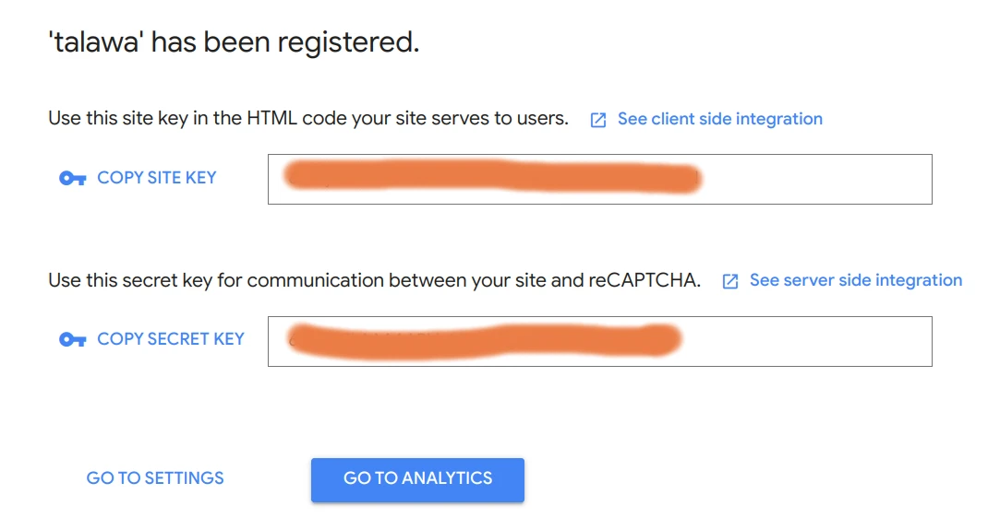

# Talawa-Admin Installation

This document provides instructions on how to set up and start a running instance of `talawa-admin` on your local system. The instructions are written to be followed in sequence so make sure to go through each of them step by step without skipping any sections.

# Table of Contents

1. [Prerequisites for Developers](#prerequisites-for-developers)
1. [Installation](#installation)
    1. [Clone this repository](#clone-this-repository)
    1. [Change directory into the cloned repo](#change-directory-into-the-cloned-repo)
    1. [Setting up yarn](#setting-up-yarn)
    1. [Installing required packages/dependencies](#installing-required-packagesdependencies)
1. [Configuration](#configuration)
    1. [Creating .env file](#creating-env-file)
    1. [Setting up REACT\_APP\_TALAWA\_URL in .env file](#setting-up-react_app_talawa_url-in-env-file)
    1. [Setting up REACT\_APP\_RECAPTCHA\_SITE\_KEY in .env file](#setting-up-react_app_recaptcha_site_key-in-env-file)
1. [Post Configuration Steps](#post-configuration-steps)
    1. [Running Talawa-Admin](#running-talawa-admin)
    1. [Accessing Talawa-Admin](#accessing-talawa-admin)
    1. [Talawa-Admin Registration](#talawa-admin-registration)
    1. [Talawa-Admin Login](#talawa-admin-login)
1. [Testing](#testing)
    1. [Running tests](#running-tests)
    1. [Linting code files](#linting-code-files)
    1. [Husky for Git Hooks](#husky-for-git-hooks)
    1. [Setting up Talawa-Admin and API for Talawa App](#setting-up-talawa-admin-and-api-for-talawa-app)

# Prerequisites for Developers

We recommend that you follow these steps before beginning development work on Talawa-Admin:

1. [Talawa-API](https://github.com/PalisadoesFoundation/talawa-api): (**This is mandatory**) The API system that the mobile app uses for accessing data. Setup your own **_local instance_**
1. [Talawa](https://github.com/PalisadoesFoundation/talawa): (Optional) The mobile app that people will use to access Talawa's features. This may be useful if you need to verify administrative features you have added or modified.

The INSTALLATION.md files in both repositories show you how. The Talawa-API INSTALLATION.md will also show you the Organization URL to use access Talawa Admin.

# Installation
You will need to have copies of your code on your local system. Here's how to do that.
## Clone This Repository

First you need a local copy of `talawa-admin`. Run the following command in the directory of choice on your local system.

```
git clone https://github.com/PalisadoesFoundation/talawa-admin
```

This will download a local copy of `talawa-admin` in that directory.

## Change Directory into the Cloned Repo

Right after cloning the repo you can change the directory of your current `terminal(shell)` to the root directory of cloned repository using this command:

```
cd talawa-admin
```

**NOTE:** `All the commands we're going to execute in the following instructions will assume you are in the root directory of the cloned talawa-admin project. If you fail to do so, the commands will not work.`

## Setting up Yarn

If you've followed the previous steps you should have already set up node.js on your system. [Click here](https://yarnpkg.com/getting-started/install) for the official setup guide for yarn.

## Installing required packages/dependencies

Run the following command to install the packages and dependencies required by `talawa-admin`:

```
yarn
```
# Configuration
It's important to configure Talawa-Admin. Here's how to do it.
## Creating .env file

A file named .env is required in the root directory of talawa-admin for storing environment variables used at runtime. It is not a part of the repo and you will have to create it. For a sample of `.env` file there is a file named `.env.sample` in the root directory. Create a new `.env` file by copying the contents of the `.env.sample` into `.env` file. Use this command:

```
cp .env.example .env
```

This `.env` file must be populated with the following environment variables for `talawa-admin` to work:

| Variable                     | Description                                 |
| ---------------------------- | ------------------------------------------- |
| REACT_APP_TALAWA_URL         | URL endpoint for talawa-api graphql service |
| REACT_APP_RECAPTCHA_SITE_KEY | Site key for authentication using reCAPTCHA |

Follow the instructions from section [Setting up REACT_APP_TALAWA_URL in .env file](#setting-up-REACT_APP_TALAWA_URL-in-env-file) up to and including section [Setting up REACT_APP_RECAPTCHA_SITE_KEY in .env file](#setting-up-REACT_APP_RECAPTCHA_SITE_KEY-in-env-file) to set up these environment variables.

## Setting up REACT_APP_TALAWA_URL in .env file

Add the endpoint for accessing talawa-api graphql service to the variable named `REACT_APP_TALAWA_URL` in the `.env` file. 

```
REACT_APP_TALAWA_URL="http://API-IP-ADRESS:4000/graphql/"
```

If you are a software developer working on your local system, then the URL would be:

```
REACT_APP_TALAWA_URL="http://localhost:4000/graphql/"
```

For additional details, please refer to to the `How to Access the Talawa-API URL` section in the INSTALLATION.md file found in the [Talawa-API repo](https://github.com/PalisadoesFoundation/talawa-api).

## Setting up REACT_APP_RECAPTCHA_SITE_KEY in .env file

Refer to to the `RECAPTCHA` section in the INSTALLATION.md file found in [Talawa-API repo](https://github.com/PalisadoesFoundation/talawa-api).


`Talawa-admin` needs the `reCAPTCHA site key` for the `reCAPTCHA` service you set up during `talawa-api` installation as shown in this screenshot:



Copy/paste this `reCAPTCHA site key` to the variable named `REACT_APP_RECAPTCHA_SITE_KEY` in `.env` file.

```
REACT_APP_RECAPTCHA_SITE_KEY="this_is_the_recaptcha_key"
```

# Post Configuration Steps
It's now time to start Talawa-Admin and get it running

## Running Talawa-Admin

Run the following command to start `talawa-admin` development server:

```
yarn serve
```

## Accessing Talawa-Admin

By default `talawa-admin` runs on port `3000` on your system's localhost. It is available on the following endpoint:

```
http://localhost:3000/
```

## Talawa-Admin Registration

The first time you navigate to the running talawa-admin's website you'll land at talawa-admin registration page. Sign up using whatever credentials you want and create the account. Make sure to remember the email and password you entered because they'll be used to sign you in later on.


## Talawa-Admin Login

Now sign in to talawa-admin using the `email` and `password` you used to sign up.

# Testing
It is important to test our code. If you are a contributor, please follow these steps.

## Running tests

You can run the tests for `talawa-admin` using this command:

```
yarn test
```

## Linting code files

You can lint your code files using this command:

```
yarn lint:fix
```

## Husky for Git Hooks

We are using the package `Husky` to automatically run the following scripts on your changes whenever you make a commit:

```
yarn format:fix
yarn lint:fix
yarn typecheck
```

This is done to improve developer experience and to make sure that your commits do not fail on the automated workflow runs. Still you can manually opt-out of the same using the `--no-verify` flag as follows:

```
git commit -m "Commit message" --no-verify
```
