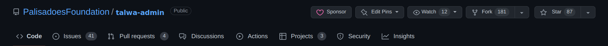
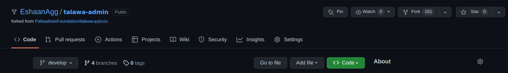
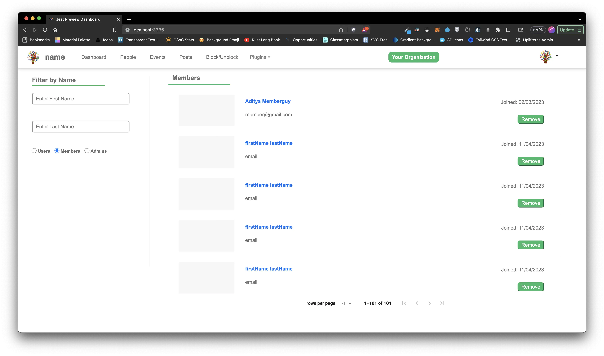

# Talawa-Admin Installation

This document provides instructions on how to set up and start a running instance of `talawa-admin` on your local system. The instructions are written to be followed in sequence so make sure to go through each of them step by step without skipping any sections.

# Table of Contents

<!-- toc -->

- [Installation Steps Summary](#installation-steps-summary)
- [Prerequisites](#prerequisites)
  - [Install git](#install-git)
  - [Setting up this repository](#setting-up-this-repository)
  - [Install node.js](#install-nodejs)
  - [Install TypeScript](#install-typescript)
  - [Install Required Packages](#install-required-packages)
- [Installation using Docker](#installation-using-docker)
  - [Prerequisites](#prerequisites-1)
    - [Development Setup](#development-setup)

<!-- tocstop -->

# Installation Steps Summary

Installation is not difficult, but there are many steps. This is a brief explanation of what needs to be done:

1. Install `git`
2. Download the code from GitHub using `git`
3. Install `node.js` (Node), the runtime environment the application will need to work.
4. Configure the Node Package Manager (`npm`) to automatically use the correct version of Node for our application.
5. Use `npm` to install TypeScript, the language the application is written in.
6. Install other supporting software such as the database.
7. Configure the application
8. Start the application

These steps are explained in more detail in the sections that follow.

# Prerequisites

In this section we'll explain how to set up all the prerequisite software packages to get you up and running.

## Install git

The easiest way to get the latest copies of our code is to install the `git` package on your computer.

Follow the setup guide for `git` on official [git docs](https://git-scm.com/downloads). Basic `git` knowledge is required for open source contribution so make sure you're comfortable with it. [Here's](https://youtu.be/apGV9Kg7ics) a good tutorial to get started with `git` and `github`.

## Setting up this repository

First you need a local copy of `talawa-admin`. Run the following command in the directory of choice on your local system.

1. On your computer, navigate to the folder where you want to setup the repository.
2. Open a `cmd` (Windows) or `terminal` (Linux or MacOS) session in this folder.
   1. An easy way to do this is to right-click and choose appropriate option based on your OS.
3. **For Our Open Source Contributor Software Developers:**

   1. Next, we'll fork and clone the `talawa-admin` repository.
   1. In your web browser, navigate to [https://github.com/PalisadoesFoundation/talawa-admin/](https://github.com/PalisadoesFoundation/talawa-admin/) and click on the `fork` button. It is placed on the right corner opposite the repository name `PalisadoesFoundation/talawa-admin`.

      

   1. You should now see `talawa-admin` under your repositories. It will be marked as forked from `PalisadoesFoundation/talawa-admin`

      

   1. Clone the repository to your local computer (replacing the values in `{{}}`):
      ```bash
      $ git clone https://github.com/{{YOUR GITHUB USERNAME}}/talawa-admin.git
      cd talawa-admin
      git checkout develop
      ```
      - **Note:** Make sure to check out the `develop` branch
   1. You now have a local copy of the code files. For more detailed instructions on contributing code, and managing the versions of this repository with `git`, checkout our [CONTRIBUTING.md](./CONTRIBUTING.md) file.

4. **Talawa Administrators:**

   1. Clone the repository to your local computer using this command:

      ```bash
      $ git clone https://github.com/PalisadoesFoundation/talawa-admin.git
      ```

## Install node.js

Best way to install and manage `node.js` is making use of node version managers. We recommend using `fnm`, which will be described in more detail later.

Follow these steps to install the `node.js` packages in Windows, Linux and MacOS.

1. For Windows:
   1. first install `node.js` from their website at https://nodejs.org
      1. When installing, don't click the option to install the `necessary tools`. These are not needed in our case.
   2. then install [fnm](https://github.com/Schniz/fnm). Please read all the steps in this section first.
      1. All the commands listed on this page will need to be run in a Windows terminal session in the `talawa-admin` directory.
      2. Install `fnm` using the `winget` option listed on the page.
      3. Setup `fnm` to automatically set the version of `node.js` to the version required for the repository using these steps:
         1. First, refer to the `fnm` web page's section on `Shell Setup` recommendations.
         2. Open a `Windows PowerShell` terminal window
         3. Run the recommended `Windows PowerShell` command to open `notepad`.
         4. Paste the recommended string into `notepad`
         5. Save the document.
         6. Exit `notepad`
         7. Exit PowerShell
         8. This will ensure that you are always using the correct version of `node.js`
2. For Linux and MacOS, use the terminal window.
   1. install `node.js`
   2. then install `fnm`
      1. Refer to the installation page's section on the `Shell Setup` recommendations.
      2. Run the respective recommended commands to setup your node environment
      3. This will ensure that you are always using the correct version of `node.js`

## Install TypeScript

TypeScript is a typed superset of JavaScript that compiles to plain JavaScript. It adds optional types, classes, and modules to JavaScript, and supports tools for large-scale JavaScript applications.

To install TypeScript, you can use the `npm` command which comes with `node.js`:

```bash
npm install -g typescript
```

This command installs TypeScript globally on your system so that it can be accessed from any project.

## Install Required Packages

Run the following command to install the packages and dependencies required by the app:

```
npm install
```

The prerequisites are now installed. The next step will be to get the app up and running.

# Installation using Docker

## Prerequisites

1. Install Docker on your system:
   - [Docker Desktop for Windows/Mac](https://www.docker.com/products/docker-desktop)
   - [Docker Engine for Linux](https://docs.docker.com/engine/install/)

### Development Setup

If you prefer to use Docker, you can install the app using the following command:

1.  Create a `.env` file as described in the Configuration section

2.  Build the Docker Image:

Run the following command to build the Docker image:

````bash
docker build -t talawa-admin .
```bash

3.  Run the Docker container:

After the build is complete, run the Docker container using this command:

```bash
docker run -p 4321:4321 talawa-admin
```bash

The application will be accessible at `http://localhost:4321`

# Configuration

It's important to configure Talawa-Admin. Here's how to do it.

You can use our interactive setup script for the configuration. Use the following command for the same.

```bash
npm run setup
```bash

All the options in "setup" can be done manually as well and here's how to do it. - [Creating .env file](#creating-env-file)

## Creating .env file

A file named .env is required in the root directory of talawa-admin for storing environment variables used at runtime. It is not a part of the repo and you will have to create it. For a sample of `.env` file there is a file named `.env.example` in the root directory. Create a new `.env` file by copying the contents of the `.env.example` into `.env` file. Use this command:

````

cp .env.example .env

```

This `.env` file must be populated with the following environment variables for `talawa-admin` to work:

| Variable                        | Description                                       |
| ------------------------------- | ------------------------------------------------- |
| PORT                            | Custom port for Talawa-Admin development purposes |
| REACT_APP_TALAWA_URL            | URL endpoint for talawa-api graphql service       |
| REACT_APP_BACKEND_WEBSOCKET_URL | URL endpoint for websocket end point              |
| REACT_APP_USE_RECAPTCHA         | Whether you want to use reCAPTCHA or not          |
| REACT_APP_RECAPTCHA_SITE_KEY    | Site key for authentication using reCAPTCHA       |

Follow the instructions from the sections [Setting up PORT in .env file](#setting-up-port-in-env-file), [Setting up REACT_APP_TALAWA_URL in .env file](#setting-up-REACT_APP_TALAWA_URL-in-env-file), [Setting up REACT_APP_BACKEND_WEBSOCKET_URL in .env file](#setting-up-react_app_backend_websocket_url-in-env-file), [Setting up REACT_APP_RECAPTCHA_SITE_KEY in .env file](#setting-up-REACT_APP_RECAPTCHA_SITE_KEY-in-env-file) and [Setting up Compiletime and Runtime logs](#setting-up-compiletime-and-runtime-logs) to set up these environment variables.

## Setting up PORT in .env file

Add a custom port number for Talawa-Admin development purposes to the variable named `PORT` in the `.env` file.

## Setting up REACT_APP_TALAWA_URL in .env file

Add the endpoint for accessing talawa-api graphql service to the variable named `REACT_APP_TALAWA_URL` in the `.env` file.

```

REACT_APP_TALAWA_URL="http://API-IP-ADRESS:4000/graphql/"

```

If you are a software developer working on your local system, then the URL would be:

```

REACT_APP_TALAWA_URL="http://localhost:4000/graphql/"

```

If you are trying to access Talawa Admin from a remote host with the API URL containing "localhost", You will have to change the API URL to

```

REACT_APP_TALAWA_URL="http://YOUR-REMOTE-ADDRESS:4000/graphql/"

```

## Setting up REACT_APP_BACKEND_WEBSOCKET_URL in .env file

The endpoint for accessing talawa-api WebSocket graphql service for handling subscriptions is automatically added to the variable named `REACT_APP_BACKEND_WEBSOCKET_URL` in the `.env` file.

```

REACT_APP_BACKEND_WEBSOCKET_URL="ws://API-IP-ADRESS:4000/graphql/"

```

If you are a software developer working on your local system, then the URL would be:

```

REACT_APP_BACKEND_WEBSOCKET_URL="ws://localhost:4000/graphql/"

```

If you are trying to access Talawa Admin from a remote host with the API URL containing "localhost", You will have to change the API URL to

```

REACT_APP_BACKEND_WEBSOCKET_URL="ws://YOUR-REMOTE-ADDRESS:4000/graphql/"

```

For additional details, please refer the `How to Access the Talawa-API URL` section in the INSTALLATION.md file found in the [Talawa-API repo](https://github.com/PalisadoesFoundation/talawa-api).

## Setting up REACT_APP_RECAPTCHA_SITE_KEY in .env file

You may not want to setup reCAPTCHA since the project will still work. Moreover, it is recommended to not set it up in development environment.

Just skip to the [Post Configuration Steps](#post-configuration-steps) if you don't want to set it up. Else, read the following steps.

If you want to setup Google reCAPTCHA now, you may refer to the `RECAPTCHA` section in the INSTALLATION.md file found in [Talawa-API repo](https://github.com/PalisadoesFoundation/talawa-api).

`Talawa-admin` needs the `reCAPTCHA site key` for the `reCAPTCHA` service you set up during `talawa-api` installation as shown in this screenshot:


Copy/paste this `reCAPTCHA site key` to the variable named `REACT_APP_RECAPTCHA_SITE_KEY` in `.env` file.

```

REACT_APP_RECAPTCHA_SITE_KEY="this_is_the_recaptcha_key"

```

## Setting up Compiletime and Runtime logs

Set the `ALLOW_LOGS` to "YES" if you want warnings , info and error messages in your console or leave it blank if you dont need them or want to keep the console clean

# Post Configuration Steps

It's now time to start Talawa-Admin and get it running

## Running Talawa-Admin

Run the following command to start `talawa-admin` development server:

```

npm run serve

```

## Accessing Talawa-Admin

By default `talawa-admin` runs on port `4321` on your system's localhost. It is available on the following endpoint:

```

http://localhost:4321/

```

If you have specified a custom port number in your `.env` file, Talawa-Admin will run on the following endpoint:

```

http://localhost:${{customPort}}/

```

Replace `${{customPort}}` with the actual custom port number you have configured in your `.env` file.

## Talawa-Admin Registration

The first time you navigate to the running talawa-admin's website you'll land at talawa-admin registration page. Sign up using whatever credentials you want and create the account. Make sure to remember the email and password you entered because they'll be used to sign you in later on.

## Talawa-Admin Login

Now sign in to talawa-admin using the `email` and `password` you used to sign up.

# Testing

It is important to test our code. If you are a contributor, please follow these steps.

## Running tests

You can run the tests for `talawa-admin` using this command:

```

npm run test

```

## Debugging tests

You can see the output of failing tests in broswer by running `jest-preview` package before running your tests

```

npm run jest-preview
npm run test

```

You don't need to re-run the `npm run jest-preview` command each time, simply run the `npm run test` command if the Jest Preview server is already running in the background, it'll automatically detect any failing tests and show the preview at `http://localhost:3336` as shown in this screenshot -



## Linting code files

You can lint your code files using this command:

```

npm run lint:fix

```

## Husky for Git Hooks

We are using the package `Husky` to run git hooks that run according to different git workflows.

#### pre-commit hook

We run a pre-commit hook which automatically runs code quality checks each time you make a commit and also fixes some of the issues. This way you don't have to run them manually each time.

If you don't want these pre-commit checks running on each commit, you can manually opt out of it using the `--no-verify` flag with your commit message as shown:-

        git commit -m "commit message" --no-verify

#### post-merge hook

We are also running a post-merge(post-pull) hook which will automatically run "npm install" only if there is any change made to pakage.json file so that the developer has all the required dependencies when pulling files from remote.

If you don't want this hook to run, you can manually opt out of this using the `no verify` flag while using the merge command(git pull):

        git pull --no-verify

<br/>
```
