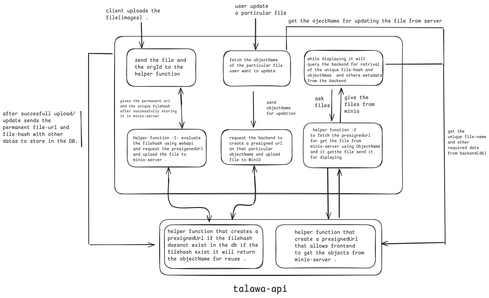

### File Upload and Management System for talawa  : 
>This is the given architecture diagram for MiniO-file upload system: 

### 1. File Upload Process:

**Client Upload:** The client selects a file for upload and initiates the process.

**Deduplication Check:** The backend calculates a unique hash (e.g., SHA-256) of the file. This hash is then used to query the database.

**Existing File Check:** If the hash exists in the database, it indicates that the file has already been uploaded. The system retrieves the existing file metadata (including the MinIO object name and URL) and returns it to the client, effectively preventing redundant uploads.

**Presigned URL Generation (Upload):** If the hash is not found, the backend generates a presigned URL for uploading the file to MinIO. This URL provides temporary, limited access to MinIO for uploading the specific file.

**File Upload to MinIO:** The client uses the presigned URL to upload the file directly to MinIO.

**Metadata Storage:** Upon successful upload, the backend stores the file metadata in the database. This includes the file hash, unique file name, MinIO object URL, and other relevant information.

### 2.File Update Process:

**User Update Request:** The user initiates an update to an existing file.

**ObjectName Retrieval:** The backend retrieves the MinIO `objectName` associated with the file from the database.

**Presigned URL Generation:** As there is no specific way to *update* files in MiniO we will be overwriting the file on the existing `objectName`. The backend generates a presigned URL for  the file in MinIO using the retrieved objectName.

**File Update to MinIO:** The client uses the presigned URL to upload the updated file to MinIO, overwriting the existing object.

**Metadata Update:** The backend updates the file metadata in the database, including the file hash (if changed) and any other relevant information.

### 3. File Display Process :

**Client Request for File Display:** The client requests to display a file, typically as part of a user's post, profile, or feed. This request includes the file's unique identifier.

**Metadata Retrieval:** The backend retrieves the file metadata from the database using the unique file identifier. This metadata includes the MinIO object name and other relevant details.

**Presigned URL Generation:** The backend generates a presigned URL for retrieving the file directly from MinIO using the `GET` method . This URL allows the client to access the file for rendering within the application .

**File Retrieval and Display:** The client uses the presigned URL to fetch the file directly from MinIO.

**File Display:** The client embeds the file (e.g., an image) within the application's user interface for display.

NOTE: Contributors need to set `NODE_ENV=DEVELOPMENT` in the `.env` file of Talawa API to configure `localhost` as the endpoint for MiniO.

## Helper-Functions
These are related helper functions.

### Uploading Files to MiniO

Used for file uploads:

1. Helper function-1 `talawa-admin`
1. location: `src\utils\MinioUpload.ts`

### For *put object*  presignedUrl

Used for creating pre-signed URLs:

1. Helper function-1 `talawa-api`
1. location: `src/graphql/types/Mutation/createPresignedUrl.ts`
