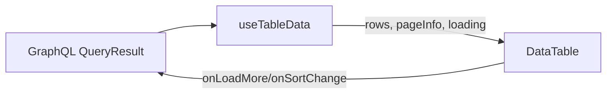

## Changelog by Phase (TableFix)

### Phase 5 (Issue #5819): Users Component DataTable Migration - Pilot Results

This phase completed a pilot migration of three admin screens (Users, BlockUser, Requests) to validate the DataTable architecture and establish patterns for future migrations.

#### Migration Summary

- **Migrated Screens:** Users.tsx, BlockUser.tsx, Requests.tsx
- **Integration Approach:** DataTable component with useTableData hook for GraphQL integration
- **State Management:** Simplified via useTableData for automatic pagination handling
- **Row Rendering:** Preserved custom UsersTableItem component for complex organization management UI
- **Feature Preservation:** Maintained search, filter (by role: admin/regular), and sort (newest/oldest) functionality
- **Testing Strategy:** Integration-level testing approach focusing on user-visible outcomes rather than DataTable internals

#### Key Patterns Learned

**1. GraphQL Integration Pattern**
```tsx
// Recommended: Use useTableData hook for automatic GraphQL pagination
const { data, fetchMore, loading, error, refetch } = useTableData({
  query: USER_LIST,
  variables: { first: pageSize, after: null },
  dataPath: 'users.edges',
});
```

**2. Custom Row Rendering**
- **When to use:** Complex row UIs with interactive elements (buttons, dropdowns, modals)
- **Pattern:** Define custom row component (e.g., UsersTableItem) and pass via `renderRow` prop
- **Benefit:** Preserves existing complex UI logic while gaining DataTable infrastructure

**3. Column Accessor Functions**
- **String accessors:** For simple property access (`accessor: 'name'`)
- **Function accessors:** For computed values or transformations
  ```tsx
  accessor: (user) => userIndexMap.get(user.id) || 0
  ```
- **Type safety:** Both patterns maintain full TypeScript inference

#### Challenges Encountered

**1. Test Flakiness in Sharded CI**
- **Issue:** `vi.restoreAllMocks()` caused mock pollution across test shards
- **Solution:** Replace with `vi.clearAllMocks()` to prevent cross-shard interference
- **Files affected:** Users.spec.tsx (line 91), Requests.spec.tsx (line 268)

**2. Scroll Event Race Conditions**
- **Issue:** Hardcoded `await wait(X)` calls caused intermittent failures
- **Solution:** Replace with `waitFor(() => expect(condition))` for proper UI synchronization
- **Locations:** Users.spec.tsx lines ~882, ~1416-1420, ~1965

**3. Trivial Test Assertions**
- **Issue:** Meaningless `expect(true).toBe(true)` provided no value
- **Solution:** Remove or replace with meaningful assertions about component behavior

**4. Complex Row Component Testing**
- **Challenge:** Testing UsersTableItem interactions within DataTable context
- **Solution:** Test through user interactions (clicks, searches) rather than implementation details

#### Best Practices Established

**Testing Approach**
1. **Integration over Unit:** Test user-visible behavior, not DataTable internals
2. **Proper Async Handling:** Use `waitFor()` with meaningful assertions instead of arbitrary delays
3. **Mock Hygiene:** Use `vi.clearAllMocks()` in sharded environments to prevent pollution
4. **Accessor Testing:** For complex accessor functions, add dedicated unit tests (e.g., userIndexMap accessor)

**Component Design**
1. **Preserve Existing UI:** Don't refactor row rendering unnecessarily—use `renderRow` for complex cases
2. **Type Safety First:** Leverage TypeScript inference through proper column definitions
3. **Feature Parity:** Maintain all existing functionality (search, filter, sort) through DataTable APIs

**Migration Strategy**
1. **Start with `useTableData`:** Simplifies GraphQL integration and state management
2. **Identify Custom Rendering Needs:** Determine early if `renderRow` is needed
3. **Test Coverage First:** Ensure existing tests pass before removing old table code
4. **Document Deviations:** Track any screen-specific solutions for future reference

#### Metrics

- **Test Coverage:** Maintained ≥95% coverage across all migrated screens
- **Test Results:** Users.spec.tsx - 89 passing, 6 todo, 0 failing
- **Code Reduction:** ~30% reduction in table-related boilerplate per screen
- **Type Safety:** 100% type-safe column definitions and accessors

#### Future Migration Recommendations

Based on pilot results, future DataTable migrations should:
1. **Use this pilot as a template** for screens with similar complexity
2. **Prioritize screens with simpler row rendering** to build team familiarity
3. **Document screen-specific patterns** in this changelog as they emerge
4. **Maintain test coverage** at current levels (≥95%)
5. **Address test flakiness proactively** using patterns from this pilot
## Introduction

What you’ll learn

- How to define strongly‑typed table columns with string and function accessors
- How to render the generic DataTable with empty/error handling
- How to use client/server pagination and the useTableData hook
- How to add loading skeletons and refetch overlays
- How to enable sorting, filtering, global search, selection, and actions
- How to test reliably with ≥ 95% coverage and migrate existing screens

## Overview

The generic DataTable provides a single, shared, strongly typed table foundation for
Talawa Admin. It replaces bespoke per‑screen tables with a consistent API for:

- Type‑safe column definitions
- Empty and error states
- Client and server pagination
- Loading skeletons/overlays
- Sorting
- Filtering and global search
- Row selection, row actions, and bulk actions

Architecture at a glance:



:::tip
Base UI uses React‑Bootstrap’s Table component to match the repo’s existing styling and
responsiveness while keeping the API minimal and framework‑agnostic.
:::

## Quick Start (Minimal)

Before → After

```tsx
// Before (bespoke table; simplified)
<Table>
  <thead>
    <tr>
      <th>Name</th>
      <th>Email</th>
    </tr>
  </thead>
  <tbody>
    {users.map((u) => (
      <tr key={u.id}>
        <td>{u.name}</td>
        <td>{u.email}</td>
      </tr>
    ))}
  </tbody>
</Table>
```

```tsx
// After (generic DataTable)
import { DataTable } from 'src/shared-components/DataTable/DataTable';
import type { ColumnDef } from 'src/shared-components/DataTable/types';

type User = { id: string; name: string; email: string };

const columns: Array<ColumnDef<User>> = [
  { id: 'name', header: 'Name', accessor: 'name' },
  { id: 'email', header: 'Email', accessor: (u) => u.email.toLowerCase() },
];

<DataTable<User>
  data={[{ id: '1', name: 'Ada', email: 'Ada@Example.com' }]}
  columns={columns}
  rowKey="id"
/>;
```

## Types reference (authoritative)

Core types used throughout the generic table system.

```ts
// Accessors
export type Accessor<T> = keyof T | ((row: T) => unknown);
export type AccessorValue<T, A extends Accessor<T>> = A extends keyof T
  ? T[A]
  : A extends (row: T) => infer R
    ? R
    : unknown;

// Sorting
export type SortDirection = 'asc' | 'desc';

// Column definition
export interface ColumnDef<T, A extends Accessor<T> = Accessor<T>> {
  id: string;
  header: string | (() => React.ReactNode);
  accessor: A;
  render?: (value: AccessorValue<T, A>, row: T) => React.ReactNode;
  meta?: {
    sortable?: boolean;
    sortFn?: (a: T, b: T) => number;
    filterable?: boolean;
    searchable?: boolean;
    filterFn?: (row: T, value: unknown) => boolean;
    getSearchValue?: (row: T) => string;
    width?: string | number;
    align?: 'left' | 'center' | 'right';
    ariaLabel?: string;
  };
}

export interface PageInfo {
  hasNextPage: boolean;
  hasPreviousPage: boolean;
  startCursor?: string;
  endCursor?: string;
}
```

```ts
// DataTable props (key fields)
export interface DataTableProps<T> {
  data: readonly T[];
  columns: readonly ColumnDef<T>[];
  loading?: boolean;
  error?: Error | null;
  renderError?: (error: Error) => React.ReactNode;
  rowKey?: keyof T | ((row: T) => string | number);
  emptyMessage?: string;

  // Pagination
  paginationMode?: 'client' | 'server';
  pageSize?: number;
  currentPage?: number;
  onPageChange?: (page: number) => void;
  totalItems?: number;
  pageInfo?: PageInfo;
  onLoadMore?: () => void;
  loadingMore?: boolean;

  // Loading optimizations
  /**
   * Number of skeleton rows to render during loading/overlay states.
   * Default: 5
   */
  skeletonRows?: number;
  /**
   * When true and data is already present, show a translucent overlay on top of the table
   * while a refetch is in flight. Overlay displays skeleton grid matching table columns.
   */
  loadingOverlay?: boolean;
  /**
   * When true, append skeleton rows at the end of the table body to indicate a partial
   * loading state (e.g., while fetchMore is running in incremental pagination).
   */
  loadingMore?: boolean;

  // Sorting
  serverSort?: boolean;
  sortBy?: string;
  sortDirection?: SortDirection;
  onSortChange?: (next: {
    sortBy: string;
    sortDirection: SortDirection;
    column: ColumnDef<T>;
  }) => void;
  initialSortBy?: string;
  initialSortDirection?: SortDirection;

  // Filtering & search
  showSearch?: boolean;
  searchPlaceholder?: string;
  globalSearch?: string;
  onGlobalSearchChange?: (q: string) => void;
  initialGlobalSearch?: string;
  columnFilters?: Record<string, unknown>;
  onColumnFiltersChange?: (filters: Record<string, unknown>) => void;
  serverSearch?: boolean;
  serverFilter?: boolean;

  // Selection & actions
  selectable?: boolean;
  selectedKeys?: ReadonlySet<string | number>;
  onSelectionChange?: (next: ReadonlySet<string | number>) => void;
  initialSelectedKeys?: ReadonlySet<string | number>;
  rowActions?: ReadonlyArray<RowAction<T>>;
  bulkActions?: ReadonlyArray<BulkAction<T>>;
}

export type Key = string | number;

export type RowAction<T> = {
  id: string;
  label: string;
  onClick: (row: T) => void;
  disabled?: boolean | ((row: T) => boolean);
  ariaLabel?: string;
};

export type BulkAction<T> = {
  id: string;
  label: string;
  onClick: (rows: T[], keys: Key[]) => void | Promise<void>;
  disabled?: boolean | ((rows: T[], keys: Key[]) => boolean);
  confirm?: string;
};

export interface TableState<T = unknown> {
  sortBy?: string;
  sortDirection?: SortDirection;
  filters?: Partial<Record<string, unknown>>;
  globalSearch?: string;
  selectedKeys?: Set<Key>;
}
```

### Short examples

```ts
// String and function accessors
const nameCol = { id: 'name', header: 'Name', accessor: 'name' } as const;
const emailCol = {
  id: 'email',
  header: 'Email',
  accessor: (u: User) => u.email.toLowerCase(),
} as const;
```

```ts
// Sort by string length via custom comparator
const byLen = {
  id: 'custom',
  header: 'Custom',
  accessor: (u: User) => u.name,
  meta: {
    sortable: true,
    sortFn: (a: User, b: User) => a.name.length - b.name.length,
  },
};
```

## File Structure and Components

The DataTable is composed of the following modules:

```
src/shared-components/DataTable/
├── DataTable.tsx                 # Main component: orchestrates layout, state
├── DataTableTable.tsx            # Presentational: renders <table> with headers, rows
├── DataTableSkeleton.tsx         # Skeleton loading state (initial load)
├── LoadingMoreRows.tsx           # Appended skeleton rows (fetchMore state)
├── SearchBar.tsx                 # Search input with debouncing
├── Pagination.tsx                # Pagination controls (client and server modes)
├── BulkActionsBar.tsx            # Bulk action buttons (when rows selected)
├── cells/ActionsCell.tsx         # Cell renderer for row action buttons
├── hooks/useTableData.ts         # Flattens GraphQL connections → rows
├── hooks/useDataTableFiltering.ts  # Manages search, column filters
├── hooks/useDataTableSelection.ts  # Manages row selection state
├── TableLoader.tsx               # Reusable skeleton grid (utility)
├── types.ts                      # Type definitions for hooks/utilities
├── utils.ts                      # Helpers: renderHeader, getCellValue, toSearchableString
├── [module].module.css           # Per‑component CSS (compose app-fixed)
└── types/                        # Type aliases and interfaces
    └── interface.ts              # ColumnDef, DataTableProps, etc.
```

### Key internal components

- **DataTable**: Main orchestrator; manages loading states, pagination, sorting, filtering.
- **DataTableTable**: Presentational component rendering `<table>` with headers, rows, and selection column.
- **DataTableSkeleton**: Renders skeleton rows during initial load (loading=true, no data yet).
- **LoadingMoreRows**: Appends skeleton rows at the end during fetchMore operations (loadingMore=true).
- **SearchBar**: Global search input with debounce; emits to parent via onGlobalSearchChange.
- **Pagination**: Pagination controls (prev/next buttons for client mode; "Load more" for server).
- **BulkActionsBar**: Shows when rows are selected; triggers bulk action callbacks.
- **ActionsCell**: Renders individual row action buttons.

## Component: DataTable

The DataTable renders headers and rows from your typed column definitions. It includes built‑in
empty/error precedence: error > loading > empty > table.

Key props (ergonomics‑focused):
| Prop | Type | Default | Notes |
| --- | --- | --- | --- |
| data | readonly T[] | [] | Rows to display |
| columns | ColumnDef\<T\>[] | — | Column configuration |
| rowKey | keyof T or fn | index | Stable keys recommended |
| loading | boolean | false | Shows loading state |
| error | Error or null | null | Renders error region |
| emptyMessage | string | "No data available" | Shown when no rows |
| paginationMode | 'client' \| 'server' | — | See Pagination |
| serverSort | boolean | false | Use onSortChange for SSR |
| showSearch | boolean | false | Renders search bar |
| selectable | boolean | false | Enables selection column |

Minimal structure example

```tsx
import { DataTable } from 'src/shared-components/DataTable/DataTable';

<DataTable<User>
  data={users}
  columns={[nameCol, emailCol]}
  loading={false}
  emptyMessage="Nothing to show"
  rowKey="id"
/>;
```

Empty and Error

```tsx
<DataTable<User>
  data={[]}
  columns={[nameCol]}
  loading={false}
  emptyMessage="No users"
/>

<DataTable<User>
  data={[]}
  columns={[nameCol]}
  error={new Error('Network timeout')}
/>
```

## Hooks

This section explains how we use hooks in the table related components.

### Hook: useTableData

The useTableData hook flattens GraphQL connections (edges → rows) and exposes pagination signals.

```ts
import { useMemo } from 'react';
import type { QueryResult, NetworkStatus } from '@apollo/client';
import type { PageInfo } from '../types';

type Edge<T> = { node: T | null } | null;
type Connection<T> =
  | { edges?: Array<Edge<T>> | null; pageInfo?: PageInfo | null }
  | null
  | undefined;

export interface UseTableDataOptions<TNode, TRow, TData> {
  path: ((data: TData) => Connection<TNode> | undefined) | (string | number)[];
  transformNode?: (node: TNode) => TRow;
  deps?: ReadonlyArray<unknown>;
}

export function useTableData<TData = unknown, TRow = unknown, TNode = unknown>(
  result: QueryResult<TData>,
  options: UseTableDataOptions<TNode, TRow, TData>,
) {
  const { data, loading, error, refetch, fetchMore, networkStatus } = result;
  const { path, transformNode, deps = [] } = options;

  const getConnection = (d: TData): Connection<TNode> =>
    typeof path === 'function'
      ? path(d)
      : path.reduce<unknown>(
          (acc, k) =>
            acc != null && typeof acc === 'object'
              ? (acc as Record<string | number, unknown>)[k]
              : undefined,
          d as unknown,
        );

  const connection = useMemo(() => getConnection(data), [data, ...deps]);

  const rows = useMemo<TRow[]>(() => {
    const nodes = (connection?.edges ?? [])
      .filter(Boolean)
      .map((e: any) => e?.node)
      .filter(Boolean) as TNode[];
    const map = transformNode ?? ((n: unknown) => n as unknown as TRow);
    return nodes.map(map);
  }, [connection, transformNode]);

  const loadingMore = networkStatus === (3 as NetworkStatus); // fetchMore

  return {
    rows,
    loading,
    loadingMore,
    error: (error as Error) ?? null,
    pageInfo: connection?.pageInfo,
    refetch,
    fetchMore,
    networkStatus,
  };
}
```

Example with GraphQL connection

```tsx
import { useQuery } from '@apollo/client';
import { useTableData } from 'src/shared-components/DataTable/hooks/useTableData';
import { DataTable } from 'src/shared-components/DataTable/DataTable';
import type { PageInfo } from 'src/shared-components/DataTable/types';

type User = { id: string; name: string; email: string };
type UsersQuery = {
  users?: {
    edges?: Array<{ node: User | null } | null> | null;
    pageInfo?: PageInfo | null;
  } | null;
};

const result = useQuery<UsersQuery>(/* GET_USERS */);
const { rows, pageInfo, loadingMore } = useTableData<UsersQuery, User, User>(result, {
  path: ['users'],
  transformNode: (n) => n,
});

<DataTable<User>
  data={rows}
  columns={[nameCol, emailCol]}
  rowKey="id"
  paginationMode="server"
  pageInfo={pageInfo}
  loadingMore={loadingMore}
  onLoadMore={() => result.fetchMore({ variables: { after: pageInfo?.endCursor } })}
/>;
```

## Pagination

The DataTable supports both client-side and server-side pagination for consistent UX across screens.

### Client-side Pagination

Use for small datasets. Data is sliced in memory.

```tsx
import { DataTable } from 'src/shared-components/DataTable/DataTable';

<DataTable<User>
  data={users}
  columns={[nameCol, emailCol]}
  rowKey="id"
  paginationMode="client"
  pageSize={10}
/>;
```

### Server-side Pagination (GraphQL cursor)

Use for large datasets. Relies on GraphQL-style `pageInfo` and `onLoadMore`.

```tsx
<DataTable<User>
  data={rows}
  columns={[nameCol]}
  rowKey="id"
  paginationMode="server"
  pageInfo={pageInfo}
  loadingMore={loadingMore}
  onLoadMore={() => fetchMore({ variables: { after: pageInfo?.endCursor } })}
/>
```

### Accessibility notes

- Pagination controls use `aria-label` and `aria-live` for screen reader support.
- Disabled states are set for prev/next buttons on first/last page.
- The "Load more" button in server mode uses `aria-busy` and disables while loading.

:::note Trade-offs

- Client mode: simple and fast for small datasets; slices in memory.
- Server mode: required for large lists; relies on pageInfo and onLoadMore.
  :::

## Loading state optimizations

Optimized loading states prevent layout shift and improve perceived performance. Skeleton rows match the table's column structure.

### Initial load skeleton

When `loading=true` and no data yet, displays a skeleton grid.

```tsx
<DataTable<User>
  data={[]}
  columns={[nameCol, emailCol]}
  loading
  skeletonRows={5}  // default: 5
/>
```

### Refetch overlay

When `loading=true` AND data already present, shows a translucent overlay with skeleton grid on top of existing rows.
This avoids content jump during refresh.

```tsx
<DataTable<User>
  data={users}
  columns={[nameCol, emailCol]}
  loading
  loadingOverlay  // true to show overlay
/>
```

### Partial loading (fetchMore)

When `loadingMore=true`, appends skeleton rows at the bottom of the table to indicate incremental data fetching.

```tsx
<DataTable<User>
  data={users}
  columns={[nameCol, emailCol]}
  loadingMore  // append skeleton rows
  skeletonRows={5}
/>
```

### Accessibility & styling

Skeleton cells render with:
- `aria-hidden="true"` (visual placeholder, not announced)
- `role="status"` + `aria-live="polite"` (grid announces loading to screen readers)
- Shimmer animation (linear gradient) for visual feedback

**CSS organization:**

All DataTable styles are centralized in `src/style/app-fixed.module.css` for theming consistency. Per‑component CSS modules (`DataTable.module.css`, `DataTableSkeleton.module.css`, etc.) compose styles from `app-fixed` to satisfy the import policy checker.

Example per-component module:

```css
/* src/shared-components/DataTable/DataTableSkeleton.module.css */
@import 'src/style/app-fixed.module.css';

.skeleton {
  composes: dataSkeleton from global;
}

.skeletonCell {
  composes: dataSkeletonCell from global;
}
```

Centralized styles in `app-fixed`:

```css
/* src/style/app-fixed.module.css */
@keyframes shimmer {
  0% {
    background-position: 0% 50%;
  }
  100% {
    background-position: 200% 50%;
  }
}

.dataSkeletonCell {
  height: 16px;
  border-radius: 6px;
  background: linear-gradient(90deg, #eee 0%, #f5f5f5 50%, #eee 100%);
  background-size: 200% 100%;
  animation: shimmer 1.2s ease-in-out infinite;
}

.dataLoadingOverlay {
  position: absolute;
  inset: 0;
  display: flex;
  align-items: center;
  justify-content: center;
  background: rgba(255, 255, 255, 0.6);
  backdrop-filter: blur(1px);
  pointer-events: none;
  z-index: 10;
  border-radius: 6px;
}
```

### TableLoader component

For reusable skeleton grids (e.g., in dialogs or custom loading states):

```tsx
import { TableLoader } from 'src/shared-components/DataTable/TableLoader';

// Grid variant (no overlay)
<TableLoader columns={columns} rows={5} ariaLabel="Loading users" />

// Overlay variant (translucent with grid)
<TableLoader columns={columns} rows={3} asOverlay />
```

## Sorting

Enable per‑column sorting and optional custom comparators.

```tsx
const columns: Array<ColumnDef<User>> = [
  { id: 'name', header: 'Name', accessor: 'name', meta: { sortable: true } },
  {
    id: 'email',
    header: 'Email',
    accessor: (u) => u.email,
    meta: { sortable: true },
  },
  {
    id: 'len',
    header: 'Name Len',
    accessor: (u) => u.name,
    meta: { sortable: true, sortFn: (a, b) => a.name.length - b.name.length },
  },
];

<DataTable<User> data={users} columns={columns} rowKey="id" />;
```

Server‑side sorting (no local reorder)

```tsx
<DataTable<User>
  data={users}
  columns={columns}
  serverSort
  sortBy="name"
  sortDirection="asc"
  onSortChange={({ sortBy, sortDirection }) => {
    // refetch with variables { orderBy: { [sortBy]: sortDirection } }
  }}
/>
```

:::warning
Default comparator is stable, case‑insensitive for strings, and places null/undefined last.
Use meta.sortFn for domain‑specific ordering.
:::

## Filtering and Global Search

Per‑column filtering and global search against searchable columns.

```tsx
const columns: Array<ColumnDef<User>> = [
  {
    id: 'name',
    header: 'Name',
    accessor: 'name',
    meta: { filterable: true, searchable: true },
  },
  {
    id: 'email',
    header: 'Email',
    accessor: 'email',
    meta: { filterable: true, searchable: true },
  },
  {
    id: 'adult',
    header: 'Adult?',
    accessor: (u) => (u.age ?? 0) >= 18,
    meta: {
      filterable: true,
      searchable: false,
      filterFn: (row, val) =>
        val === 'yes'
          ? (row.age ?? 0) >= 18
          : val === 'no'
            ? (row.age ?? 0) < 18
            : true,
    },
  },
  {
    id: 'complex',
    header: 'Complex',
    accessor: 'complexData',
    meta: {
      getSearchValue: (row) => row.complexData?.label ?? '',
    },
  },
];

<DataTable<User>
  data={users}
  columns={columns}
  rowKey="id"
  showSearch
  initialGlobalSearch=""
  columnFilters={{ name: 'ada' }}
/>;
```

Server modes: don’t filter locally, just emit changes.

```tsx
<DataTable<User>
  data={users}
  columns={columns}
  showSearch
  globalSearch=""
  onGlobalSearchChange={(q) => /* refetch with q */ null}
  columnFilters={{}}
  onColumnFiltersChange={(f) => /* refetch with f */ null}
  serverSearch
  serverFilter
/>
```

## Selection, Row Actions, and Bulk Actions

Enable selection, add row actions, and bulk actions for selected rows.

```tsx
import type {
  IRowAction,
  IBulkAction,
} from 'src/types/shared-components/DataTable/interface';

const rowActions: IRowAction<User>[] = [
  { id: 'open', label: 'Open', onClick: (u) => console.log('open', u.id) },
  {
    id: 'disable',
    label: 'Disable',
    onClick: (u) => console.log('disable', u.id),
    disabled: (u) => u.email.endsWith('@example.com'),
  },
];

const bulkActions: IBulkAction<User>[] = [
  {
    id: 'export',
    label: 'Export CSV',
    onClick: (rows) => console.log('export', rows.length),
  },
  {
    id: 'remove',
    label: 'Remove',
    confirm: 'Remove selected users?',
    onClick: (rows, keys) => console.log('remove', keys),
  },
];

<DataTable<User>
  data={users}
  columns={[nameCol, emailCol]}
  rowKey="id"
  selectable
  rowActions={rowActions}
  bulkActions={bulkActions}
/>;
```

## Accessibility

- Errors: role="alert" and aria‑live="assertive"
- Loading/empty: aria‑busy and aria‑live="polite"
- Sortable headers: set aria‑sort to ascending/descending/none
- Search input: role="searchbox" via type="search" and explicit aria‑label
- Selection: each checkbox has a readable label; header checkbox uses indeterminate state

:::tip
Always provide a stable rowKey (e.g., "id") to keep focus and screen reader context consistent
across updates.
:::

## Testing and Coverage

Target: ≥ 95% coverage for files touched by table work.

Recommended test areas

- Types sanity (compile smoke tests for ColumnDef/DataTableProps)
- Rendering basics (headers, cell values; string and function accessors)
- Precedence: error > loading > empty
- Pagination: client slice, server load‑more, disabled edges
- Loading: skeleton grid, overlay with existing rows, appended skeletons
- Sorting: asc/desc toggle, custom sortFn, stability on ties, nulls last
- Filtering/search: default contains, custom filterFn, server emit‑only
- Selection/actions: single row, select‑all indeterminate, row actions, bulk actions
- Accessibility roles/attributes (aria‑sort, aria‑live, checkbox labels)

## Performance & Gotchas

- Memoize columns with useMemo when defined inline to avoid re‑renders
- Prefer lightweight cell renderers; avoid heavy closures in render()
- Use stable rowKey to minimize DOM diffing and preserve selection/focus
- For server pagination/sorting/filtering, debounce user input to reduce chatter
- When using fetchMore, ensure notifyOnNetworkStatusChange is enabled if you rely on loadingMore

## Migration Guide (Playbook)

1. Identify the screen’s list query and row type T.
2. Define columns: start with string accessors, add function accessors as needed.
3. Replace bespoke markup with DataTable\<T\>, passing columns and data.
4. Add empty/error handling via DataTable’s built‑ins (remove local placeholders).
5. Choose pagination mode:
   - Small list: client (pageSize)
   - Large/infinite: server (pageInfo, onLoadMore)
6. Add sorting:
   - Client: meta.sortable (+ sortFn if needed)
   - Server: serverSort + onSortChange → refetch
7. Add filtering/global search:
   - Local: showSearch + columnFilters / initialGlobalSearch
   - Server: serverSearch/serverFilter + emit callbacks → refetch
8. Add selection/actions if required: selectable, rowActions, bulkActions.
9. Tests: cover precedence chains, key flows; reach ≥ 95% coverage.
10. Remove legacy table utilities and dead styles.

Before → After (concise)

```tsx
// Before: bespoke, no built-ins, ad-hoc loaders/errors
<LegacyUsersTable users={data?.users ?? []} />

// After: generic, consistent, extensible
<DataTable<User>
  data={rows}
  columns={[nameCol, emailCol]}
  rowKey="id"
  paginationMode="server"
  pageInfo={pageInfo}
  onLoadMore={loadMore}
/>
```

## FAQ

- Why string vs function accessors?
  - String accessors are simple and optimal when mapping fields. Function accessors allow
    transformations (e.g., formatting) without duplicating data.

- When should I choose server pagination/sort?
  - Any list that can grow large or must reflect backend ordering/search should use server mode.

- How do I add a custom filter?
  - Provide meta.filterFn per column. Return true to keep a row; value comes from columnFilters[id].

- How do I disable a bulk action conditionally?
  - Supply a disabled predicate receiving selected rows and keys; return true to disable.

## Changelog by Phase (TableFix)

- Phase 1
  - Define Column System and TypeScript Interfaces
  - Build DataTable Component Structure
  - Add Empty State and Error Handling
- Phase 2
  - Add Pagination Support
  - Create useTableData Hook
  - Add Loading State Optimizations
- Phase 3
  - Implement Sorting Functionality
  - Add Filtering and Search Capabilities
  - Implement Row and Bulk Actions
