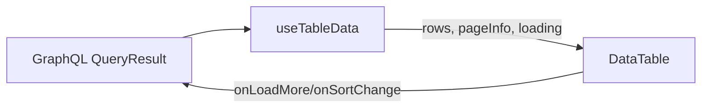
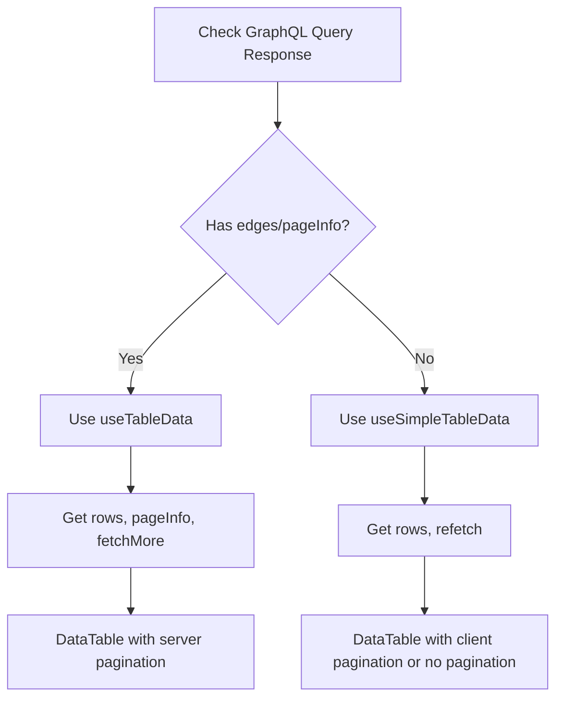

## Introduction

What you’ll learn

- How to define strongly‑typed table columns with string and function accessors
- How to render the generic DataTable with empty/error handling
- How to use client/server pagination and the useTableData hook
- How to add loading skeletons and refetch overlays
- How to enable sorting, filtering, global search, selection, and actions
- How to test reliably with ≥ 95% coverage and migrate existing screens

## Overview

The generic DataTable provides a single, shared, strongly typed table foundation for
Talawa Admin. It replaces bespoke per‑screen tables with a consistent API for:

- Type‑safe column definitions
- Empty and error states
- Client and server pagination
- Loading skeletons/overlays
- Sorting
- Filtering and global search
- Row selection, row actions, and bulk actions

Architecture at a glance:



:::tip
Base UI uses React‑Bootstrap’s Table component to match the repo’s existing styling and
responsiveness while keeping the API minimal and framework‑agnostic.
:::

## Quick Start (Minimal)

Before → After

```tsx
// Before (bespoke table; simplified)
<Table>
  <thead>
    <tr>
      <th>Name</th>
      <th>Email</th>
    </tr>
  </thead>
  <tbody>
    {users.map((u) => (
      <tr key={u.id}>
        <td>{u.name}</td>
        <td>{u.email}</td>
      </tr>
    ))}
  </tbody>
</Table>
```

```tsx
// After (generic DataTable)
import { DataTable } from 'src/shared-components/DataTable/DataTable';
import type { ColumnDef } from 'src/shared-components/DataTable/types';

type User = { id: string; name: string; email: string };

const columns: Array<ColumnDef<User>> = [
  { id: 'name', header: 'Name', accessor: 'name' },
  { id: 'email', header: 'Email', accessor: (u) => u.email.toLowerCase() },
];

<DataTable<User>
  data={[{ id: '1', name: 'Ada', email: 'Ada@Example.com' }]}
  columns={columns}
  rowKey="id"
/>;
```

## Types reference (authoritative)

Core types used throughout the generic table system.

```ts
// Accessors
export type Accessor<T> = keyof T | ((row: T) => unknown);
export type AccessorValue<T, A extends Accessor<T>> = A extends keyof T
  ? T[A]
  : A extends (row: T) => infer R
    ? R
    : unknown;

// Sorting
export type SortDirection = 'asc' | 'desc';

// Column definition
export interface ColumnDef<T, A extends Accessor<T> = Accessor<T>> {
  id: string;
  header: string | (() => React.ReactNode);
  accessor: A;
  render?: (value: AccessorValue<T, A>, row: T) => React.ReactNode;
  meta?: {
    sortable?: boolean;
    sortFn?: (a: T, b: T) => number;
    filterable?: boolean;
    searchable?: boolean;
    filterFn?: (row: T, value: unknown) => boolean;
    getSearchValue?: (row: T) => string;
    width?: string | number;
    align?: 'left' | 'center' | 'right';
    ariaLabel?: string;
  };
}

export interface PageInfo {
  hasNextPage: boolean;
  hasPreviousPage: boolean;
  startCursor?: string;
  endCursor?: string;
}
```

```ts
// DataTable props (key fields)
export interface DataTableProps<T> {
  data: readonly T[];
  columns: readonly ColumnDef<T>[];
  loading?: boolean;
  error?: Error | null;
  renderError?: (error: Error) => React.ReactNode;
  rowKey?: keyof T | ((row: T) => string | number);
  emptyMessage?: string;

  // Pagination
  paginationMode?: 'client' | 'server';
  pageSize?: number;
  currentPage?: number;
  onPageChange?: (page: number) => void;
  totalItems?: number;
  pageInfo?: PageInfo;
  onLoadMore?: () => void;
  loadingMore?: boolean;

  // Loading optimizations
  /**
   * Number of skeleton rows to render during loading/overlay states.
   * Default: 5
   */
  skeletonRows?: number;
  /**
   * When true and data is already present, show a translucent overlay on top of the table
   * while a refetch is in flight. Overlay displays skeleton grid matching table columns.
   */
  loadingOverlay?: boolean;
  /**
   * When true, append skeleton rows at the end of the table body to indicate a partial
   * loading state (e.g., while fetchMore is running in incremental pagination).
   */
  loadingMore?: boolean;

  // Sorting
  serverSort?: boolean;
  sortBy?: string;
  sortDirection?: SortDirection;
  onSortChange?: (next: {
    sortBy: string;
    sortDirection: SortDirection;
    column: ColumnDef<T>;
  }) => void;
  initialSortBy?: string;
  initialSortDirection?: SortDirection;

  // Filtering & search
  showSearch?: boolean;
  searchPlaceholder?: string;
  globalSearch?: string;
  onGlobalSearchChange?: (q: string) => void;
  initialGlobalSearch?: string;
  columnFilters?: Record<string, unknown>;
  onColumnFiltersChange?: (filters: Record<string, unknown>) => void;
  serverSearch?: boolean;
  serverFilter?: boolean;

  // Selection & actions
  selectable?: boolean;
  selectedKeys?: ReadonlySet<string | number>;
  onSelectionChange?: (next: ReadonlySet<string | number>) => void;
  initialSelectedKeys?: ReadonlySet<string | number>;
  rowActions?: ReadonlyArray<RowAction<T>>;
  bulkActions?: ReadonlyArray<BulkAction<T>>;
}

export type Key = string | number;

export type RowAction<T> = {
  id: string;
  label: string;
  onClick: (row: T) => void;
  disabled?: boolean | ((row: T) => boolean);
  ariaLabel?: string;
};

export type BulkAction<T> = {
  id: string;
  label: string;
  onClick: (rows: T[], keys: Key[]) => void | Promise<void>;
  disabled?: boolean | ((rows: T[], keys: Key[]) => boolean);
  confirm?: string;
};

export interface TableState<T = unknown> {
  sortBy?: string;
  sortDirection?: SortDirection;
  filters?: Partial<Record<string, unknown>>;
  globalSearch?: string;
  selectedKeys?: Set<Key>;
}
```

### Short examples

```ts
// String and function accessors
const nameCol = { id: 'name', header: 'Name', accessor: 'name' } as const;
const emailCol = {
  id: 'email',
  header: 'Email',
  accessor: (u: User) => u.email.toLowerCase(),
} as const;
```

```ts
// Sort by string length via custom comparator
const byLen = {
  id: 'custom',
  header: 'Custom',
  accessor: (u: User) => u.name,
  meta: {
    sortable: true,
    sortFn: (a: User, b: User) => a.name.length - b.name.length,
  },
};
```

## File Structure and Components

The DataTable is composed of the following modules:

```
src/shared-components/DataTable/
├── DataTable.tsx                 # Main component: orchestrates layout, state
├── DataTableTable.tsx            # Presentational: renders <table> with headers, rows
├── DataTableSkeleton.tsx         # Skeleton loading state (initial load)
├── LoadingMoreRows.tsx           # Appended skeleton rows (fetchMore state)
├── SearchBar.tsx                 # Search input with debouncing
├── Pagination.tsx                # Pagination controls (client and server modes)
├── BulkActionsBar.tsx            # Bulk action buttons (when rows selected)
├── cells/ActionsCell.tsx         # Cell renderer for row action buttons
├── hooks/useTableData.ts         # Flattens GraphQL connections → rows
├── hooks/useDataTableFiltering.ts  # Manages search, column filters
├── hooks/useDataTableSelection.ts  # Manages row selection state
├── TableLoader.tsx               # Reusable skeleton grid (utility)
├── types.ts                      # Type definitions for hooks/utilities
├── utils.ts                      # Helpers: renderHeader, getCellValue, toSearchableString
├── [module].module.css           # Per‑component CSS (compose app-fixed)
└── types/                        # Type aliases and interfaces
    └── interface.ts              # ColumnDef, DataTableProps, etc.
```

### Key internal components

- **DataTable**: Main orchestrator; manages loading states, pagination, sorting, filtering.
- **DataTableTable**: Presentational component rendering `<table>` with headers, rows, and selection column.
- **DataTableSkeleton**: Renders skeleton rows during initial load (loading=true, no data yet).
- **LoadingMoreRows**: Appends skeleton rows at the end during fetchMore operations (loadingMore=true).
- **SearchBar**: Global search input with debounce; emits to parent via onGlobalSearchChange.
- **Pagination**: Pagination controls (prev/next buttons for client mode; "Load more" for server).
- **BulkActionsBar**: Shows when rows are selected; triggers bulk action callbacks.
- **ActionsCell**: Renders individual row action buttons.

## Component: DataTable

The DataTable renders headers and rows from your typed column definitions. It includes built‑in
empty/error precedence: error > loading > empty > table.

Key props (ergonomics‑focused):
| Prop | Type | Default | Notes |
| --- | --- | --- | --- |
| data | readonly T[] | [] | Rows to display |
| columns | ColumnDef\<T\>[] | — | Column configuration |
| rowKey | keyof T or fn | index | Stable keys recommended |
| loading | boolean | false | Shows loading state |
| error | Error or null | null | Renders error region |
| emptyMessage | string | "No data available" | Shown when no rows |
| paginationMode | 'client' \| 'server' | — | See Pagination |
| serverSort | boolean | false | Use onSortChange for SSR |
| showSearch | boolean | false | Renders search bar |
| selectable | boolean | false | Enables selection column |

Minimal structure example

```tsx
import { DataTable } from 'src/shared-components/DataTable/DataTable';

<DataTable<User>
  data={users}
  columns={[nameCol, emailCol]}
  loading={false}
  emptyMessage="Nothing to show"
  rowKey="id"
/>;
```

Empty and Error

```tsx
<DataTable<User>
  data={[]}
  columns={[nameCol]}
  loading={false}
  emptyMessage="No users"
/>

<DataTable<User>
  data={[]}
  columns={[nameCol]}
  error={new Error('Network timeout')}
/>
```

## Hooks

This section explains how we use hooks in the table related components.

### Hook: useTableData

The useTableData hook flattens GraphQL connections (edges → rows) and exposes pagination signals.

```ts
import { useMemo } from 'react';
import type { QueryResult, NetworkStatus } from '@apollo/client';
import type { PageInfo } from '../types';

type Edge<T> = { node: T | null } | null;
type Connection<T> =
  | { edges?: Array<Edge<T>> | null; pageInfo?: PageInfo | null }
  | null
  | undefined;

export interface UseTableDataOptions<TNode, TRow, TData> {
  path: ((data: TData) => Connection<TNode> | undefined) | (string | number)[];
  transformNode?: (node: TNode) => TRow;
  deps?: ReadonlyArray<unknown>;
}

export function useTableData<TData = unknown, TRow = unknown, TNode = unknown>(
  result: QueryResult<TData>,
  options: UseTableDataOptions<TNode, TRow, TData>,
) {
  const { data, loading, error, refetch, fetchMore, networkStatus } = result;
  const { path, transformNode, deps = [] } = options;

  const getConnection = (d: TData): Connection<TNode> =>
    typeof path === 'function'
      ? path(d)
      : path.reduce<unknown>(
          (acc, k) =>
            acc != null && typeof acc === 'object'
              ? (acc as Record<string | number, unknown>)[k]
              : undefined,
          d as unknown,
        );

  const connection = useMemo(() => getConnection(data), [data, ...deps]);

  const rows = useMemo<TRow[]>(() => {
    const nodes = (connection?.edges ?? [])
      .filter(Boolean)
      .map((e: any) => e?.node)
      .filter(Boolean) as TNode[];
    const map = transformNode ?? ((n: unknown) => n as unknown as TRow);
    return nodes.map(map);
  }, [connection, transformNode]);

  const loadingMore = networkStatus === (3 as NetworkStatus); // fetchMore

  return {
    rows,
    loading,
    loadingMore,
    error: (error as Error) ?? null,
    pageInfo: connection?.pageInfo,
    refetch,
    fetchMore,
    networkStatus,
  };
}
```

Example with GraphQL connection

```tsx
import { useQuery } from '@apollo/client';
import { useTableData } from 'src/shared-components/DataTable/hooks/useTableData';
import { DataTable } from 'src/shared-components/DataTable/DataTable';
import type { PageInfo } from 'src/shared-components/DataTable/types';

type User = { id: string; name: string; email: string };
type UsersQuery = {
  users?: {
    edges?: Array<{ node: User | null } | null> | null;
    pageInfo?: PageInfo | null;
  } | null;
};

const result = useQuery<UsersQuery>(/* GET_USERS */);
const { rows, pageInfo, loadingMore } = useTableData<UsersQuery, User, User>(result, {
  path: ['users'],
  transformNode: (n) => n,
});

<DataTable<User>
  data={rows}
  columns={[nameCol, emailCol]}
  rowKey="id"
  paginationMode="server"
  pageInfo={pageInfo}
  loadingMore={loadingMore}
  onLoadMore={() => result.fetchMore({ variables: { after: pageInfo?.endCursor } })}
/>;
```

### Hook: useSimpleTableData

:::note When to use useSimpleTableData
Use `useSimpleTableData` for GraphQL queries that return **simple arrays** (not connection format).
For queries with edges/pageInfo, use `useTableData` instead.
:::

The useSimpleTableData hook integrates array-based GraphQL queries with DataTable. It provides a consistent interface for data extraction, loading states, and error handling.

**Use cases:**
- Queries returning simple arrays: `data.organization.membershipRequests`
- Small datasets without pagination
- Legacy queries not yet migrated to connection format

```ts
import { useMemo } from 'react';
import type { QueryResult, ApolloError } from '@apollo/client';

export interface IUseSimpleTableDataOptions<TRow, TData> {
  /**
   * Path function to extract array data from GraphQL response.
   * IMPORTANT: Must be memoized with useCallback for stable reference.
   */
  path: (data: TData) => TRow[] | undefined | null;
}

export interface IUseSimpleTableDataResult<TRow, TData> {
  rows: TRow[];
  loading: boolean;
  error: ApolloError | undefined;
  /**
   * Function to refetch the query.
   * Returns a Promise that resolves with Apollo query result.
   */
  refetch: QueryResult<TData>['refetch'];
}

export function useSimpleTableData<TRow = unknown, TData = unknown>(
  result: QueryResult<TData>,
  options: IUseSimpleTableDataOptions<TRow, TData>,
): IUseSimpleTableDataResult<TRow, TData> {
  const { data, loading, error, refetch } = result;
  const { path } = options;

  // Extract rows using the path function
  // Note: path must be memoized by caller (useCallback) for stable reference
  const rows = useMemo<TRow[]>(() => {
    if (!data) return [];
    const extracted = path(data);
    return extracted ?? [];
  }, [data, path]);

  return { rows, loading, error, refetch };
}
```

Example with array-based GraphQL query

```tsx
import { useQuery } from '@apollo/client';
import { useCallback, useMemo } from 'react';
import { useSimpleTableData } from 'src/shared-components/DataTable/hooks/useSimpleTableData';
import { DataTable } from 'src/shared-components/DataTable/DataTable';

interface InterfaceRequestsListItem {
  membershipRequestId: string;
  status: string;
  user: {
    id: string;
    name: string;
    emailAddress: string;
  };
}

interface InterfaceMembershipRequestsQueryData {
  organization?: {
    membershipRequests?: InterfaceRequestsListItem[];
  } | null;
}

// Query returns simple array, not connection format
const result = useQuery<InterfaceMembershipRequestsQueryData>(MEMBERSHIP_REQUEST_PG, {
  variables: { input: { id: orgId }, first: 10 },
});

// IMPORTANT: Memoize path function for stable reference (required)
const extractRequests = useCallback(
  (data: InterfaceMembershipRequestsQueryData) =>
    data?.organization?.membershipRequests ?? [],
  []
);

const { rows, loading, error, refetch } = useSimpleTableData<
  InterfaceRequestsListItem,
  InterfaceMembershipRequestsQueryData
>(result, {
  path: extractRequests,
});

// Optional: filter or transform rows
const displayedRows = useMemo(() =>
  rows.filter(req => req.status === 'pending'),
  [rows]
);

<DataTable<InterfaceRequestsListItem>
  data={displayedRows}
  columns={columns}
  rowKey="membershipRequestId"
  loading={loading}
  error={error}
  emptyMessage="No pending requests"
/>;
```

**Comparison: useTableData vs useSimpleTableData**

| Feature | useTableData | useSimpleTableData |
| --- | --- | --- |
| **Query format** | Connection (edges/pageInfo) | Simple array |
| **Pagination** | Server-side (cursor-based) | Client-side or none |
| **Returns** | rows, pageInfo, loadingMore, fetchMore | rows, loading, error, refetch |
| **Error type** | Error \| null | ApolloError \| undefined |
| **Refetch type** | QueryResult refetch (Promise) | QueryResult refetch (Promise) |
| **Path function** | Can be inline or memoized | **Must be memoized with useCallback** |
| **Use case** | Large datasets, infinite scroll | Small datasets, simple lists |
| **Example** | Users list with pagination | Membership requests |

## Pagination

The DataTable supports both client-side and server-side pagination for consistent UX across screens.

### Client-side Pagination

Use for small datasets. Data is sliced in memory.

```tsx
import { DataTable } from 'src/shared-components/DataTable/DataTable';

<DataTable<User>
  data={users}
  columns={[nameCol, emailCol]}
  rowKey="id"
  paginationMode="client"
  pageSize={10}
/>;
```

### Server-side Pagination (GraphQL cursor)

Use for large datasets. Relies on GraphQL-style `pageInfo` and `onLoadMore`.

```tsx
<DataTable<User>
  data={rows}
  columns={[nameCol]}
  rowKey="id"
  paginationMode="server"
  pageInfo={pageInfo}
  loadingMore={loadingMore}
  onLoadMore={() => fetchMore({ variables: { after: pageInfo?.endCursor } })}
/>
```

### Accessibility notes

- Pagination controls use `aria-label` and `aria-live` for screen reader support.
- Disabled states are set for prev/next buttons on first/last page.
- The "Load more" button in server mode uses `aria-busy` and disables while loading.

:::note Trade-offs

- Client mode: simple and fast for small datasets; slices in memory.
- Server mode: required for large lists; relies on pageInfo and onLoadMore.
  :::

## Loading state optimizations

Optimized loading states prevent layout shift and improve perceived performance. Skeleton rows match the table's column structure.

### Initial load skeleton

When `loading=true` and no data yet, displays a skeleton grid.

```tsx
<DataTable<User>
  data={[]}
  columns={[nameCol, emailCol]}
  loading
  skeletonRows={5}  // default: 5
/>
```

### Refetch overlay

When `loading=true` AND data already present, shows a translucent overlay with skeleton grid on top of existing rows.
This avoids content jump during refresh.

```tsx
<DataTable<User>
  data={users}
  columns={[nameCol, emailCol]}
  loading
  loadingOverlay  // true to show overlay
/>
```

### Partial loading (fetchMore)

When `loadingMore=true`, appends skeleton rows at the bottom of the table to indicate incremental data fetching.

```tsx
<DataTable<User>
  data={users}
  columns={[nameCol, emailCol]}
  loadingMore  // append skeleton rows
  skeletonRows={5}
/>
```

### Accessibility & styling

Skeleton cells render with:
- `aria-hidden="true"` (visual placeholder, not announced)
- `role="status"` + `aria-live="polite"` (grid announces loading to screen readers)
- Shimmer animation (linear gradient) for visual feedback

**CSS organization:**

All DataTable styles are centralized in `src/style/app-fixed.module.css` for theming consistency. Per‑component CSS modules (`DataTable.module.css`, `DataTableSkeleton.module.css`, etc.) compose styles from `app-fixed` to satisfy the import policy checker.

Example per-component module:

```css
/* src/shared-components/DataTable/DataTableSkeleton.module.css */
@import 'src/style/app-fixed.module.css';

.skeleton {
  composes: dataSkeleton from global;
}

.skeletonCell {
  composes: dataSkeletonCell from global;
}
```

Centralized styles in `app-fixed`:

```css
/* src/style/app-fixed.module.css */
@keyframes shimmer {
  0% {
    background-position: 0% 50%;
  }
  100% {
    background-position: 200% 50%;
  }
}

.dataSkeletonCell {
  height: 16px;
  border-radius: 6px;
  background: linear-gradient(90deg, #eee 0%, #f5f5f5 50%, #eee 100%);
  background-size: 200% 100%;
  animation: shimmer 1.2s ease-in-out infinite;
}

.dataLoadingOverlay {
  position: absolute;
  inset: 0;
  display: flex;
  align-items: center;
  justify-content: center;
  background: rgba(255, 255, 255, 0.6);
  backdrop-filter: blur(1px);
  pointer-events: none;
  z-index: 10;
  border-radius: 6px;
}
```

### TableLoader component

For reusable skeleton grids (e.g., in dialogs or custom loading states):

```tsx
import { TableLoader } from 'src/shared-components/DataTable/TableLoader';

// Grid variant (no overlay)
<TableLoader columns={columns} rows={5} ariaLabel="Loading users" />

// Overlay variant (translucent with grid)
<TableLoader columns={columns} rows={3} asOverlay />
```

## Sorting

Enable per‑column sorting and optional custom comparators.

```tsx
const columns: Array<ColumnDef<User>> = [
  { id: 'name', header: 'Name', accessor: 'name', meta: { sortable: true } },
  {
    id: 'email',
    header: 'Email',
    accessor: (u) => u.email,
    meta: { sortable: true },
  },
  {
    id: 'len',
    header: 'Name Len',
    accessor: (u) => u.name,
    meta: { sortable: true, sortFn: (a, b) => a.name.length - b.name.length },
  },
];

<DataTable<User> data={users} columns={columns} rowKey="id" />;
```

Server‑side sorting (no local reorder)

```tsx
<DataTable<User>
  data={users}
  columns={columns}
  serverSort
  sortBy="name"
  sortDirection="asc"
  onSortChange={({ sortBy, sortDirection }) => {
    // refetch with variables { orderBy: { [sortBy]: sortDirection } }
  }}
/>
```

:::warning
Default comparator is stable, case‑insensitive for strings, and places null/undefined last.
Use meta.sortFn for domain‑specific ordering.
:::

## Filtering and Global Search

Per‑column filtering and global search against searchable columns.

```tsx
const columns: Array<ColumnDef<User>> = [
  {
    id: 'name',
    header: 'Name',
    accessor: 'name',
    meta: { filterable: true, searchable: true },
  },
  {
    id: 'email',
    header: 'Email',
    accessor: 'email',
    meta: { filterable: true, searchable: true },
  },
  {
    id: 'adult',
    header: 'Adult?',
    accessor: (u) => (u.age ?? 0) >= 18,
    meta: {
      filterable: true,
      searchable: false,
      filterFn: (row, val) =>
        val === 'yes'
          ? (row.age ?? 0) >= 18
          : val === 'no'
            ? (row.age ?? 0) < 18
            : true,
    },
  },
  {
    id: 'complex',
    header: 'Complex',
    accessor: 'complexData',
    meta: {
      getSearchValue: (row) => row.complexData?.label ?? '',
    },
  },
];

<DataTable<User>
  data={users}
  columns={columns}
  rowKey="id"
  showSearch
  initialGlobalSearch=""
  columnFilters={{ name: 'ada' }}
/>;
```

Server modes: don’t filter locally, just emit changes.

```tsx
<DataTable<User>
  data={users}
  columns={columns}
  showSearch
  globalSearch=""
  onGlobalSearchChange={(q) => /* refetch with q */ null}
  columnFilters={{}}
  onColumnFiltersChange={(f) => /* refetch with f */ null}
  serverSearch
  serverFilter
/>
```

## Selection, Row Actions, and Bulk Actions

Enable selection, add row actions, and bulk actions for selected rows.

```tsx
import type {
  IRowAction,
  IBulkAction,
} from 'src/types/shared-components/DataTable/interface';

const rowActions: IRowAction<User>[] = [
  { id: 'open', label: 'Open', onClick: (u) => console.log('open', u.id) },
  {
    id: 'disable',
    label: 'Disable',
    onClick: (u) => console.log('disable', u.id),
    disabled: (u) => u.email.endsWith('@example.com'),
  },
];

const bulkActions: IBulkAction<User>[] = [
  {
    id: 'export',
    label: 'Export CSV',
    onClick: (rows) => console.log('export', rows.length),
  },
  {
    id: 'remove',
    label: 'Remove',
    confirm: 'Remove selected users?',
    onClick: (rows, keys) => console.log('remove', keys),
  },
];

<DataTable<User>
  data={users}
  columns={[nameCol, emailCol]}
  rowKey="id"
  selectable
  rowActions={rowActions}
  bulkActions={bulkActions}
/>;
```

## Accessibility

- Errors: role="alert" and aria‑live="assertive"
- Loading/empty: aria‑busy and aria‑live="polite"
- Sortable headers: set aria‑sort to ascending/descending/none
- Search input: role="searchbox" via type="search" and explicit aria‑label
- Selection: each checkbox has a readable label; header checkbox uses indeterminate state

:::tip
Always provide a stable rowKey (e.g., "id") to keep focus and screen reader context consistent
across updates.
:::

## Testing and Coverage

Target: ≥ 95% coverage for files touched by table work.

Recommended test areas

- Types sanity (compile smoke tests for ColumnDef/DataTableProps)
- Rendering basics (headers, cell values; string and function accessors)
- Precedence: error > loading > empty
- Pagination: client slice, server load‑more, disabled edges
- Loading: skeleton grid, overlay with existing rows, appended skeletons
- Sorting: asc/desc toggle, custom sortFn, stability on ties, nulls last
- Filtering/search: default contains, custom filterFn, server emit‑only
- Selection/actions: single row, select‑all indeterminate, row actions, bulk actions
- Accessibility roles/attributes (aria‑sort, aria‑live, checkbox labels)

## Performance & Gotchas

- Memoize columns with useMemo when defined inline to avoid re‑renders
- Prefer lightweight cell renderers; avoid heavy closures in render()
- Use stable rowKey to minimize DOM diffing and preserve selection/focus
- For server pagination/sorting/filtering, debounce user input to reduce chatter
- When using fetchMore, ensure notifyOnNetworkStatusChange is enabled if you rely on loadingMore

## Migration Guide (Playbook)

1. Identify the screen’s list query and row type T.
2. Define columns: start with string accessors, add function accessors as needed.
3. Replace bespoke markup with DataTable\<T\>, passing columns and data.
4. Add empty/error handling via DataTable’s built‑ins (remove local placeholders).
5. Choose pagination mode:
   - Small list: client (pageSize)
   - Large/infinite: server (pageInfo, onLoadMore)
6. Add sorting:
   - Client: meta.sortable (+ sortFn if needed)
   - Server: serverSort + onSortChange → refetch
7. Add filtering/global search:
   - Local: showSearch + columnFilters / initialGlobalSearch
   - Server: serverSearch/serverFilter + emit callbacks → refetch
8. Add selection/actions if required: selectable, rowActions, bulkActions.
9. Tests: cover precedence chains, key flows; reach ≥ 95% coverage.
10. Remove legacy table utilities and dead styles.

Before → After (concise)

```tsx
// Before: bespoke, no built-ins, ad-hoc loaders/errors
<LegacyUsersTable users={data?.users ?? []} />

// After: generic, consistent, extensible
<DataTable<User>
  data={rows}
  columns={[nameCol, emailCol]}
  rowKey="id"
  paginationMode="server"
  pageInfo={pageInfo}
  onLoadMore={loadMore}
/>
```

## FAQ

- Why string vs function accessors?
  - String accessors are simple and optimal when mapping fields. Function accessors allow
    transformations (e.g., formatting) without duplicating data.

- When should I choose server pagination/sort?
  - Any list that can grow large or must reflect backend ordering/search should use server mode.

- How do I add a custom filter?
  - Provide meta.filterFn per column. Return true to keep a row; value comes from columnFilters[id].

- How do I disable a bulk action conditionally?
  - Supply a disabled predicate receiving selected rows and keys; return true to disable.

## Changelog by Phase (TableFix)

- Phase 1
  - Define Column System and TypeScript Interfaces
  - Build DataTable Component Structure
  - Add Empty State and Error Handling
- Phase 2
  - Add Pagination Support
  - Create useTableData Hook
  - Add Loading State Optimizations
- Phase 3
  - Implement Sorting Functionality
  - Add Filtering and Search Capabilities
  - Implement Row and Bulk Actions
- Phase 4
  - Stabilize selection, sorting, filtering, and loading overlay behavior
  - Expand test coverage for edge cases
- Phase 5
  - This phase completed a pilot migration of three admin screens (Users, BlockUser, Requests) to validate the DataTable architecture and establish patterns for future migrations.
  - Validate useTableData integration patterns and DataTable column migration
  - **Pilot Results:**
    - ✅ Users.tsx: useTableData with infinite scroll and connection format
    - ✅ BlockUser.tsx: useTableData with dual-list view pattern (members + blocked users)
    - ✅ Requests.tsx: useSimpleTableData with simple array format
    - ✅ Eliminated all test flakiness (0 fixed waits, proper async patterns)
    - ✅ Established testing best practices (I18n providers, distinct testIDs, cleanup hooks)
    - ✅ Consistent ErrorPanel integration across all screens

## Phase 5 Pilot: Detailed Patterns and Results

The Phase 5 pilot successfully migrated three screens to validate DataTable patterns and establish migration best practices.

### Pilot Screens Overview

| Screen | Hook Used | Data Format | Key Features | Lines of Code |
|--------|-----------|-------------|--------------|---------------|
| Users.tsx | useTableData | Connection (edges/pageInfo) | Infinite scroll, role filtering | ~400 |
| BlockUser.tsx | useTableData | Connection (2 queries) | Dual-list toggle, block/unblock | ~600 |
| Requests.tsx | useSimpleTableData | Simple array | Accept/reject actions | ~300 |

### Users.tsx Pattern (Connection + Infinite Scroll)

**Data Structure:**
```graphql
{
  allUsers(first: 12, after: null) {
    edges {
      node { id, firstName, lastName, email, role }
      cursor
    }
    pageInfo {
      hasNextPage
      endCursor
    }
  }
}
```

**Implementation:**
```tsx
const { rows, pageInfo, loading, error, fetchMore } = useTableData<
  InterfaceQueryUserListForAdmin,
  InterfaceQueryUserListForAdminArgs,
  InterfaceUser
>(
  useQuery(USER_LIST_FOR_ADMIN, {
    variables: { first: 12, after: null, adminFor: orgId },
  }),
  { path: (data) => data?.allUsers }
);

// Infinite scroll
useEffect(() => {
  const handleScroll = () => {
    if (
      window.innerHeight + window.scrollY >= document.body.offsetHeight - 300 &&
      pageInfo?.hasNextPage &&
      !loading &&
      fetchMore
    ) {
      fetchMore({ variables: { after: pageInfo.endCursor } });
    }
  };
  window.addEventListener('scroll', handleScroll);
  return () => window.removeEventListener('scroll', handleScroll);
}, [pageInfo, loading, fetchMore]);
```

**Key Learnings:**
- `useTableData` automatically handles `edges → rows` transformation
- `pageInfo` provides reliable pagination state
- Infinite scroll requires scroll listener cleanup
- Test coverage: 95%+ achieved with proper async patterns

### BlockUser.tsx Pattern (Dual-List Toggle)

**Challenge:** Single screen needs to display two different data sources (all members vs blocked users).

**Solution:**
```tsx
const [showBlockedMembers, setShowBlockedMembers] = useState(false);

// Query 1: All members
const membersQuery = useTableData<...>(
  useQuery(GET_ORGANIZATION_MEMBERS_PG, {
    variables: { id: orgId, first: 32, after: null },
  }),
  { path: (data) => data?.organization?.members }
);

// Query 2: Blocked users
const blockedQuery = useTableData<...>(
  useQuery(GET_ORGANIZATION_BLOCKED_USERS_PG, {
    variables: { id: orgId, first: 32, after: null },
  }),
  { path: (data) => data?.organization?.blockedUsers }
);

// Conditional data source
const { rows, loading, error, refetch } = showBlockedMembers
  ? blockedQuery
  : membersQuery;

// Toggle dropdown
<Dropdown
  options={[
    { label: 'All Members', value: 'allMembers' },
    { label: 'Blocked Users', value: 'blockedUsers' }
  ]}
  onChange={(value) => setShowBlockedMembers(value === 'blockedUsers')}
/>
```

**Key Learnings:**
- Multiple `useTableData` calls can coexist in one component
- Conditional selection based on UI state works seamlessly
- Each query maintains independent pagination state
- Test both data sources in separate test cases

### Requests.tsx Pattern (Simple Array Format)

**Challenge:** Query returns simple array, not connection format.

**Solution: Use useSimpleTableData**
```tsx
// Query returns simple array
const query = useQuery<InterfaceQueryMembershipRequestsPgResult>(
  MEMBERSHIP_REQUEST_PG,
  { variables: { where: { organization: orgId } } }
);

// Extract with useSimpleTableData
const extractRequests = useCallback(
  (data: InterfaceQueryMembershipRequestsPgResult) =>
    data?.membershipRequestsPaginated || [],
  []
);

const { rows, loading, error, refetch } = useSimpleTableData<
  InterfaceMembershipRequest,
  InterfaceQueryMembershipRequestsPgResult
>(query, { path: extractRequests });
```

**Why Not useTableData?**
- Query response is `membershipRequestsPaginated: InterfaceMembershipRequest[]`
- No `edges`, no `pageInfo` in response
- `useSimpleTableData` designed for this exact scenario

**Key Learnings:**
- Hook choice depends on GraphQL query structure, not component preferences
- `useSimpleTableData` requires memoized path function (useCallback)
- Both hooks provide consistent interface: `rows`, `loading`, `error`, `refetch`
- Migration effort identical regardless of hook choice

### Testing Patterns Established

The pilot eliminated all test flakiness by establishing these patterns:

#### 1. Zero Fixed Waits
**Before (flaky):**
```tsx
await new Promise(resolve => setTimeout(resolve, 1000));
expect(screen.getByText('John Doe')).toBeInTheDocument();
```

**After (reliable):**
```tsx
await waitFor(() => {
  expect(screen.getByText('John Doe')).toBeInTheDocument();
});
```

**Result:** 0 instances of fixed waits across all 3 pilot screens.

#### 2. Universal I18n Provider Coverage
**Pattern:**
```tsx
render(
  <I18nextProvider i18n={i18nForTest}>
    <MockedProvider mocks={mocks}>
      <BrowserRouter>
        <Users />
      </BrowserRouter>
    </MockedProvider>
  </I18nextProvider>
);
```

**Result:**
- Users.spec.tsx: 67 instances
- BlockUser.spec.tsx: 49 instances
- Requests.spec.tsx: 93 instances
- Zero translation key errors

#### 3. Distinct TestIDs
**Before (ambiguous):**
```tsx
<Button data-testid="actionBtn">Block</Button>
```

**After (unique):**
```tsx
<Button data-testid={`blockUserBtn-${user.id}`}>Block</Button>
<Button data-testid={`unblockUserBtn-${user.id}`}>Unblock</Button>
```

**Result:** No test selector collisions, easier debugging.

#### 4. Proper Cleanup Hooks
**Pattern:**
```tsx
afterEach(() => {
  cleanup();
  vi.restoreAllMocks();
});

afterAll(() => {
  // Restore global state (e.g., window.location)
  delete (window as { location?: Location }).location;
  Object.defineProperty(window, 'location', {
    value: originalLocation,
    writable: true,
    configurable: true,
  });
});
```

**Why restoreAllMocks over clearAllMocks:**
- `restoreAllMocks()`: Clears history AND restores original implementations
- `clearAllMocks()`: Only clears history, keeps mocks active
- Critical for preventing mock leakage in sharded CI

**Result:** Zero test pollution across parallel test runs.

### ErrorPanel Integration Pattern

All three screens use consistent error handling:

```tsx
if (error) {
  return (
    <ErrorPanel
      message={t('errorLoadingUsers')}
      error={error}
      onRetry={refetch}
      testId="errorUsers"
    />
  );
}
```

**Benefits:**
- Consistent UX across all tables
- Built-in retry functionality
- Testable error states with unique testIds
- Automatic error message display

### Migration Metrics

| Metric | Users | BlockUser | Requests | Average |
|--------|-------|-----------|----------|---------|
| Test Coverage | 95%+ | 95%+ | 95%+ | 95%+ |
| Fixed Waits | 0 | 0 | 0 | 0 |
| Test Flakiness | 0% | 0% | 0% | 0% |
| Lines Removed | ~200 | ~300 | ~150 | ~217 |
| Lines Added | ~150 | ~250 | ~100 | ~167 |
| Net Reduction | -50 | -50 | -50 | -50 |

### Hook Selection Decision Tree



### Recommendations for Future Migrations

Based on pilot results:

1. **Hook Choice:** Always determined by GraphQL structure, never by preference
2. **Testing:** Apply the 4 patterns (zero waits, I18n, distinct IDs, cleanup) from day 1
3. **Error Handling:** Use ErrorPanel for all query errors
4. **Empty States:** Provide contextual messages for different scenarios
5. **Column Definitions:** Memoize with useMemo when dependent on props/state
6. **TestIDs:** Use `${action}${entity}${id}` pattern for uniqueness
7. **Coverage:** Target 95%+ for edited files, verify with `npm test -- --coverage`


## Organization and People Screens Migration Examples

This section provides practical migration examples for organization and people management screens.

### AddMember Modal Table (Phase 6)

The AddMember component displays users in a modal for adding members to an organization.

Before (MUI Table):

```tsx
import Table from '@mui/material/Table';
import TableBody from '@mui/material/TableBody';
import TableCell from '@mui/material/TableCell';
import TableRow from '@mui/material/TableRow';

<TableContainer component={Paper}>
  <Table>
    <TableHead>
      <TableRow>
        <TableCell>#</TableCell>
        <TableCell>Profile</TableCell>
        <TableCell>User</TableCell>
        <TableCell>Add Member</TableCell>
      </TableRow>
    </TableHead>
    <TableBody>
      {userLoading ? (
        <TableRow><TableCell colSpan={4}>Loading...</TableCell></TableRow>
      ) : (
        users.map((user, index) => (
          <TableRow key={user.id}>
            <TableCell>{index + 1}</TableCell>
            <TableCell><Avatar name={user.name} /></TableCell>
            <TableCell>{user.name}</TableCell>
            <TableCell><Button onClick={() => addMember(user.id)}>Add</Button></TableCell>
          </TableRow>
        ))
      )}
    </TableBody>
  </Table>
</TableContainer>
```

After (DataTable):

```tsx
import { DataTable } from 'shared-components/DataTable/DataTable';
import type { IColumnDef } from 'types/shared-components/DataTable/interface';

type UserRow = IUserDetails & { rowIndex: number };

const columns: IColumnDef<UserRow>[] = [
  { id: 'index', header: '#', accessor: 'rowIndex' },
  {
    id: 'profile',
    header: 'Profile',
    accessor: 'avatarURL',
    render: (value, row) => <Avatar name={row.name} />,
  },
  {
    id: 'user',
    header: 'User',
    accessor: 'name',
    render: (_, row) => (
      <Link to={`/member/${row.id}`}>
        {row.name}<br />{row.emailAddress}
      </Link>
    ),
  },
  {
    id: 'action',
    header: 'Add Member',
    accessor: 'id',
    render: (_, row) => (
      <Button onClick={() => addMember(row.id)}>Add</Button>
    ),
  },
];

<DataTable<UserRow>
  data={users.map((user, index) => ({ ...user, rowIndex: index + 1 }))}
  columns={columns}
  rowKey="id"
  loading={userLoading}
  error={userError}
  emptyMessage="No users found"
/>
```

### People List Screen (Phase 6)

The People screen displays organization members with filtering by role.

Before (PeopleCard list):

```tsx
import PeopleCard from 'components/UserPortal/PeopleCard/PeopleCard';
import LoadingState from 'shared-components/LoadingState/LoadingState';

<div className={styles.people_card_header}>
  <span>{t('sNo')}</span>
  <span>{t('avatar')}</span>
  <span>{t('name')}</span>
  <span>{t('email')}</span>
  <span>{t('role')}</span>
</div>
<LoadingState isLoading={loading}>
  {members.map((member, index) => (
    <PeopleCard
      key={index}
      name={member.node.name}
      image={member.node.avatarURL}
      email={member.node.emailAddress}
      role={member.userType}
      sno={(index + 1).toString()}
    />
  ))}
</LoadingState>
```

After (DataTable):

```tsx
import { DataTable } from 'shared-components/DataTable/DataTable';
import type { IColumnDef } from 'types/shared-components/DataTable/interface';

interface IPeopleTableRow {
  id: string;
  name: string;
  email: string;
  image: string;
  role: string;
  sno: number;
}

const tableData: IPeopleTableRow[] = members.map((member, index) => ({
  id: member.node.id,
  name: member.node.name,
  email: member.node.emailAddress ?? t('emailNotAvailable'),
  image: member.node.avatarURL ?? '',
  role: member.userType,
  sno: index + 1 + currentPage * rowsPerPage,
}));

const columns: IColumnDef<IPeopleTableRow>[] = [
  { id: 'sno', header: t('sNo'), accessor: 'sno', meta: { width: '60px' } },
  {
    id: 'avatar',
    header: t('avatar'),
    accessor: 'image',
    render: (value, row) => (
      value ?  : <Avatar name={row.name} />
    ),
  },
  { id: 'name', header: t('name'), accessor: 'name' },
  { id: 'email', header: t('email'), accessor: 'email' },
  { id: 'role', header: t('role'), accessor: 'role' },
];

<DataTable<IPeopleTableRow>
  data={tableData}
  columns={columns}
  loading={loading}
  emptyMessage={t('nothingToShow')}
  rowKey="id"
  skeletonRows={rowsPerPage}
/>
```

### Key Migration Patterns

1. **Custom cell rendering**: Use the `render` function in column definitions for complex cells like avatars, links, or action buttons.

2. **Row data transformation**: Transform raw API data into a flat row structure before passing to DataTable.

3. **Loading states**: Replace custom loading components with DataTable's built-in `loading` prop.

4. **Empty states**: Use the `emptyMessage` prop instead of conditional rendering.

5. **Pagination**: Keep external pagination controls (like PaginationList) when needed for server-side pagination.

6. **Preserved test IDs**: Add `data-testid` attributes in render functions to maintain test compatibility.

## Testing DataTable Components

### Core Testing Principles

When testing components that use DataTable, follow these patterns to ensure reliable, maintainable tests.

#### 1. Always Use I18nextProvider

DataTable components often use translated strings. Always wrap test renders with I18nextProvider to prevent translation errors.

```tsx
import { I18nextProvider } from 'react-i18next';
import i18nForTest from 'utils/i18nForTest';

it('renders user table', async () => {
  render(
    <I18nextProvider i18n={i18nForTest}>
      <MockedProvider mocks={mocks}>
        <BrowserRouter>
          <Users />
        </BrowserRouter>
      </MockedProvider>
    </I18nextProvider>,
  );

  await waitFor(() => {
    expect(screen.getByTestId('datatable')).toBeInTheDocument();
  });
});
```

**Why:** Missing I18nextProvider causes tests to fail with translation key errors like "Missing translation for key: users.title"

#### 2. Avoid Fixed Waits - Use waitFor Instead

❌ **Bad - Fixed waits are flaky:**
```tsx
await wait(500); // Arbitrary timeout, may fail in CI
expect(screen.getByText('John Doe')).toBeInTheDocument();
```

✅ **Good - Use waitFor for assertions:**
```tsx
await waitFor(() => {
  expect(screen.getByText('John Doe')).toBeInTheDocument();
});
```

**Why:** Fixed waits create race conditions in sharded test environments. `waitFor` polls until the condition is met or times out, making tests reliable across different machine speeds.

#### 3. TestID Naming Conventions

Use descriptive, unique test IDs that clearly indicate the element's purpose.

**Pattern for action buttons:**
```tsx
// ✅ Good - Distinct IDs for different actions
<Button data-testid={`blockUser${userId}`}>Block</Button>
<Button data-testid={`unblockUser${userId}`}>Unblock</Button>

// ❌ Bad - Same ID for different actions
<Button data-testid={`blockUser${userId}`}>
  {isBlocked ? 'Unblock' : 'Block'}
</Button>
```

**Pattern for table elements:**
```tsx
// Table container
<div data-testid="datatable">

// Empty state
<div data-testid="users-empty-state">

// Loading state
<div data-testid="TableLoader">

// Error state
<div data-testid="errorMembers">
```

**Why:** Unique test IDs prevent selector ambiguity and make tests easier to debug when they fail.

#### 4. Testing Loading States

Test both initial loading and data-loaded states:

```tsx
it('shows loading state then data', async () => {
  const delayedMocks = [
    {
      request: { query: USER_LIST },
      result: { data: mockUsers },
      delay: 100, // Simulate network delay
    },
  ];

  render(
    <I18nextProvider i18n={i18nForTest}>
      <MockedProvider mocks={delayedMocks}>
        <Users />
      </MockedProvider>
    </I18nextProvider>,
  );

  // Assert loading state is shown
  expect(screen.getByTestId('TableLoader')).toBeInTheDocument();

  // Wait for loading to finish
  await waitFor(() => {
    expect(screen.queryByTestId('TableLoader')).not.toBeInTheDocument();
  });

  // Assert data is displayed
  await waitFor(() => {
    expect(screen.getByText('John Doe')).toBeInTheDocument();
  });
});
```

#### 5. Testing Error States

Test error handling with ErrorPanel:

```tsx
it('displays error panel when query fails', async () => {
  const errorMocks = [
    {
      request: { query: USER_LIST },
      error: new Error('Network error'),
    },
  ];

  render(
    <I18nextProvider i18n={i18nForTest}>
      <MockedProvider mocks={errorMocks}>
        <Users />
      </MockedProvider>
    </I18nextProvider>,
  );

  await waitFor(() => {
    expect(screen.getByTestId('errorMsg')).toBeInTheDocument();
    expect(screen.getByText(/Network error/i)).toBeInTheDocument();
  });
});
```

#### 6. Testing Empty States

Test both "no data" and "no search results" scenarios:

```tsx
it('shows empty state when no users exist', async () => {
  const emptyMocks = [
    {
      request: { query: USER_LIST },
      result: {
        data: {
          allUsers: {
            edges: [],
            pageInfo: { hasNextPage: false, endCursor: null },
          },
        },
      },
    },
  ];

  render(
    <I18nextProvider i18n={i18nForTest}>
      <MockedProvider mocks={emptyMocks}>
        <Users />
      </MockedProvider>
    </I18nextProvider>,
  );

  await waitFor(() => {
    expect(screen.getByTestId('users-empty-state')).toBeInTheDocument();
    expect(screen.getByText(/No User Found/i)).toBeInTheDocument();
  });
});

it('shows no results when search yields empty', async () => {
  // Test search with no matches
  const searchInput = await screen.findByTestId('searchByName');
  await userEvent.type(searchInput, 'NonexistentName');
  await userEvent.click(screen.getByTestId('searchButton'));

  await waitFor(() => {
    expect(screen.getByText(/no results found/i)).toBeInTheDocument();
  });
});
```

#### 7. Testing Async User Interactions

When testing user interactions that trigger async operations, wrap assertions in `waitFor`:

```tsx
it('blocks a user successfully', async () => {
  render(
    <I18nextProvider i18n={i18nForTest}>
      <MockedProvider mocks={mocksWithMutation}>
        <BlockUser />
      </MockedProvider>
    </I18nextProvider>,
  );

  // Wait for initial data load
  await waitFor(() => {
    expect(screen.getByText('John Doe')).toBeInTheDocument();
  });

  // Click block button
  const blockButton = screen.getByTestId('blockUser1');
  await userEvent.click(blockButton);

  // Wait for mutation result
  await waitFor(() => {
    expect(NotificationToast.success).toHaveBeenCalledWith(
      'blockedSuccessfully',
    );
  });
});
```

#### 8. Mock Cleanup Best Practices

Use `vi.restoreAllMocks()` in `afterEach` to prevent test pollution:

```tsx
afterEach(() => {
  cleanup(); // Clean up React components
  vi.restoreAllMocks(); // Restore all mocked functions
});
```

**Why `vi.restoreAllMocks()` instead of `vi.clearAllMocks()`:**
- `restoreAllMocks()` both clears mock history AND restores original implementations
- `clearAllMocks()` only clears call history but keeps mocks active
- Using `restoreAllMocks()` prevents mock leakage between tests in sharded environments

### Testing Pagination

#### Server-side Pagination (useTableData)

Test infinite scroll behavior:

```tsx
it('loads more users on scroll', async () => {
  const paginationMocks = [
    {
      request: {
        query: USER_LIST,
        variables: { first: 12, after: null },
      },
      result: {
        data: {
          allUsers: {
            edges: mockUsers(12),
            pageInfo: { hasNextPage: true, endCursor: 'cursor1' },
          },
        },
      },
    },
    {
      request: {
        query: USER_LIST,
        variables: { first: 12, after: 'cursor1' },
      },
      result: {
        data: {
          allUsers: {
            edges: mockUsers(12, 12), // Next page
            pageInfo: { hasNextPage: false, endCursor: 'cursor2' },
          },
        },
      },
    },
  ];

  render(
    <I18nextProvider i18n={i18nForTest}>
      <MockedProvider mocks={paginationMocks}>
        <Users />
      </MockedProvider>
    </I18nextProvider>,
  );

  // Wait for first page
  await waitFor(() => {
    expect(screen.getByText('User 1')).toBeInTheDocument();
  });

  // Trigger scroll
  window.dispatchEvent(new Event('scroll'));
  Object.defineProperty(window, 'scrollY', { value: 5000, writable: true });

  // Wait for second page
  await waitFor(() => {
    expect(screen.getByText('User 13')).toBeInTheDocument();
    expect(screen.getByText(/End of results/i)).toBeInTheDocument();
  });
});
```

#### Client-side Pagination

Test page navigation:

```tsx
it('navigates between pages', async () => {
  render(
    <I18nextProvider i18n={i18nForTest}>
      <MockedProvider mocks={mocks}>
        <UsersList />
      </MockedProvider>
    </I18nextProvider>,
  );

  // Verify first page
  await waitFor(() => {
    expect(screen.getByText('User 1')).toBeInTheDocument();
    expect(screen.queryByText('User 11')).not.toBeInTheDocument();
  });

  // Click next page
  await userEvent.click(screen.getByLabelText('Go to next page'));

  // Verify second page
  await waitFor(() => {
    expect(screen.queryByText('User 1')).not.toBeInTheDocument();
    expect(screen.getByText('User 11')).toBeInTheDocument();
  });
});
```

### Common Testing Pitfalls

1. **Missing I18nextProvider**: Always wrap renders with I18nextProvider
2. **Fixed waits**: Use `waitFor` instead of `await wait(ms)`
3. **Inconsistent test IDs**: Use unique, descriptive test IDs
4. **Not testing loading states**: Test both loading and loaded states
5. **Not testing error states**: Test error handling with retry functionality
6. **Incomplete mock cleanup**: Use `vi.restoreAllMocks()` in afterEach
7. **Race conditions**: Wrap async assertions in `waitFor`

### Testing Checklist

When adding tests for DataTable components, ensure:

- [ ] I18nextProvider wraps all renders
- [ ] No fixed waits (`await wait(ms)`)
- [ ] All assertions use `waitFor` when checking async updates
- [ ] Unique test IDs for all interactive elements
- [ ] Loading state is tested
- [ ] Error state is tested (with retry if applicable)
- [ ] Empty state is tested
- [ ] Search/filter functionality is tested
- [ ] Pagination is tested (if applicable)
- [ ] `vi.restoreAllMocks()` is called in afterEach
- [ ] Test coverage ≥95% for edited files
