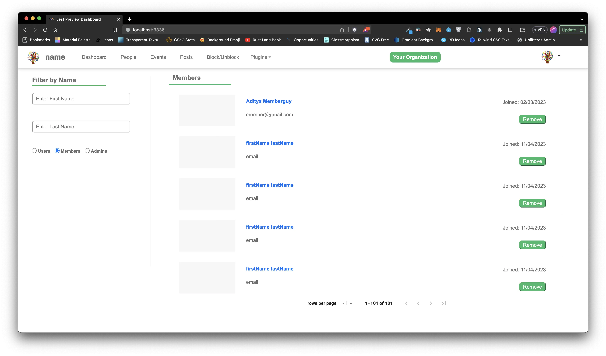

## Introduction

It is important to test our code. If you are a contributor, please follow the guidance on this page.

### Developers using Microsoft Windows

All our workflows use Linux based commands, therefore if you are a developer who codes in Microsoft Windows then we strongly suggest that you use the Windows Subsystem for Linux (WSL) as your command line interface (CLI).

### UI/UX Testing

If you have loaded the API sample database, then you can login using the credentials found on the [testing page of the API documentation website](https://docs-api.talawa.io/docs/developer-resources/testing/)

### Running tests

You can run the tests for `talawa-admin` using this command:

```bash
npm run test

```

### Debugging tests

You can see the output of failing tests in broswer by running `jest-preview` package before running your tests

```bash
npm run jest-preview
npm run test

```

You don't need to re-run the `npm run jest-preview` command each time, simply run the `npm run test` command if the Jest Preview server is already running in the background, it'll automatically detect any failing tests and show the preview at `http://localhost:3336` as shown in this screenshot -



### Linting code files

You can lint your code files using this command:

```bash
npm run lint:fix
```

### Husky for Git Hooks

We are using the package `Husky` to run git hooks that run according to different git workflows.

##### pre-commit hook

We run a pre-commit hook which automatically runs code quality checks each time you make a commit and also fixes some of the issues. This way you don't have to run them manually each time.

If you don't want these pre-commit checks running on each commit, you can manually opt out of it using the `--no-verify` flag with your commit message as shown:-

```bash
git commit -m "commit message" --no-verify
```

##### post-merge hook

We are also running a post-merge(post-pull) hook which will automatically run "npm install" only if there is any change made to pakage.json file so that the developer has all the required dependencies when pulling files from remote.

If you don't want this hook to run, you can manually opt out of this using the `--no-verify` flag while using the merge command `git pull`:

```bash
git pull --no-verify
```
