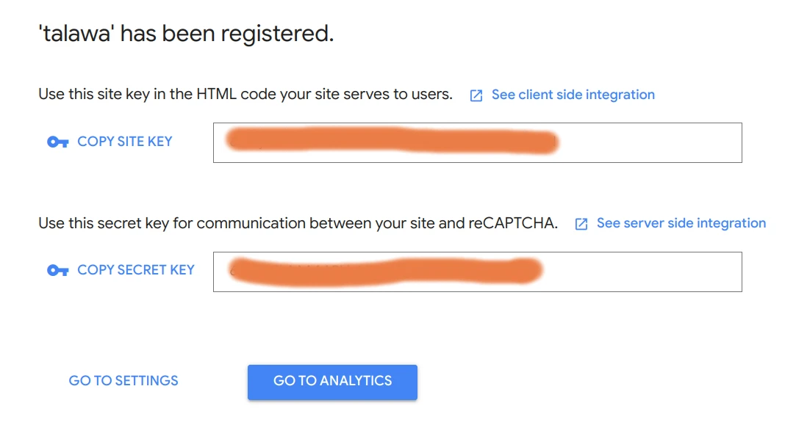

It's important to configure Talawa-Admin. Here's how to do it.

## Automated Setup

You can use our interactive setup script for the configuration. Use the following command for the same.

```bash
pnpm run setup
```

All the options in "setup" can be done manually as well and this is covered in a section below.

## Manual Setup

The setup script only modifies the most common configuration parameters. This section explains how to manually edit these values.                               
### The .env Configuration File

A file named .env is required in the root directory of talawa-admin for storing environment variables used at runtime. It is not a part of the repo and you will have to create it. For a sample of `.env` file there is a file named `.env.example` in the root directory. Create a new `.env` file by copying the contents of the `.env.example` into `.env` file. Use this command:

```
cp .env.example .env

```

#### .env Parameters

This `.env` file must be populated with the following environment variables for `talawa-admin` to work:

| Variable                     | Description                                       |
| ---------------------------- | ------------------------------------------------- |
| PORT                         | Custom port for Talawa-Admin development purposes |
| USE_DOCKER                   | Whether you want to use Docker or not             |
| DOCKER_PORT                  | Port to use when running with Docker              |
| REACT_APP_TALAWA_URL         | URL endpoint for talawa-api graphql service       |
| REACT_APP_USE_RECAPTCHA      | Whether you want to use reCAPTCHA or not          |
| REACT_APP_RECAPTCHA_SITE_KEY | Site key for authentication using reCAPTCHA       |
| ALLOW_LOGS                   | Whether you want to see logs in the console       |

> **Note:** In previous versions, `REACT_APP_BACKEND_WEBSOCKET_URL` was required as a separate variable. This is no longer needed - WebSocket connections are now automatically proxied through the same `/graphql` endpoint as HTTP requests.
#### Setting up PORT in .env file

Add a custom port number for Talawa-Admin development purposes to the variable named `PORT` in the `.env` file. This is skipped if `USE_DOCKER` is set to "YES".

#### Setting up USE_DOCKER in .env file

Set `USE_DOCKER` to "YES" if you want to run the application using Docker. Otherwise, set it to "NO".

```
USE_DOCKER="YES"
```

#### Setting up DOCKER_PORT in .env file

If `USE_DOCKER` is enabled, specifying the port number for the Docker container in the `DOCKER_PORT` variable is required.

```
DOCKER_PORT="3000"
```

### Deployment & Configuration Scenarios

Choose the scenario that matches your setup to configure `REACT_APP_TALAWA_URL` correctly.

| Scenario | Setup Type | .env Configuration | Detailed Notes |
| :--- | :--- | :--- | :--- |
| **1. Docker (Local & LAN)** | Running via `docker compose`. | `http://talawa-api:4000/graphql` | **Critical:** Inside Docker, `localhost` does not work. You must use the **Service Name** defined in `docker-compose.yml` (e.g., `talawa-api`). This works even if accessing the app from other devices on the network. |
| **2. Manual (Local & LAN)** | Running `pnpm start` on your machine. | `http://localhost:4000/graphql` | The Vite proxy (running on your host machine) forwards requests to the API. **Do not change to IP.** Even when accessing from other devices, the proxy handles the internal connection to localhost. |
| **3. Production (Manual)** | Deploying static build files. | `https://api.yourdomain.com/graphql` | **Important:** The Vite proxy is **OFF** in production. You must configure your web server (Nginx/Apache) to handle CORS or serve the API on the same domain. ||

#### Setting up REACT_APP_TALAWA_URL in .env file

To connect the Admin panel to the API and avoid CORS issues, you only need to configure **one variable** in your `.env` file: `REACT_APP_TALAWA_URL`.

The application will automatically handle the necessary proxy routing based on your environment.

**Configuration Examples by Scenario:**

| Scenario | Deployment Type | API Location | `.env` Configuration | Notes |
| :--- | :--- | :--- | :--- | :--- |
| **1** | **Docker** | Same System (Localhost) | `REACT_APP_TALAWA_URL=http://localhost:4000/graphql` | The internal Nginx container handles the proxy automatically. |
| **2** | **Docker** | Different Systems (Remote) | `REACT_APP_TALAWA_URL=http://<SERVER_IP>:4000/graphql` | Users access the Admin app via the Server IP. Nginx proxies requests internally. |
| **3** | **Manual (Dev Mode)** | Same System (Localhost) | `REACT_APP_TALAWA_URL=http://localhost:4000/graphql` | The Vite dev server proxies requests to localhost:4000. |
| **4** | **Manual (Dev Mode)** | Different Systems (Remote) | `REACT_APP_TALAWA_URL=http://<API_IP>:4000/graphql` | Set this to the IP of the machine running the API. Vite will proxy requests there. |

**Important for Manual Production Builds:**
If you are deploying a production build manually without Docker, the Vite Dev Server is not active. You must configure your web server (Nginx or Apache) to forward requests from `/graphql` to your API URL, similar to the rules found in `config/docker/setup/`.

#### Setting up REACT_APP_RECAPTCHA_SITE_KEY in .env file

This is an optional parameter.

You may not want to setup reCAPTCHA since the project will still work. Moreover, it is recommended to not set it up in development environment.

If you want to setup Google reCAPTCHA now, you may refer to the `RECAPTCHA` section in the INSTALLATION.md file found in [Talawa-API repo](https://github.com/PalisadoesFoundation/talawa-api).

`Talawa-admin` needs the `reCAPTCHA site key` for the `reCAPTCHA` service you set up during `talawa-api` installation as shown in this screenshot:



Copy/paste this `reCAPTCHA site key` to the variable named `REACT_APP_RECAPTCHA_SITE_KEY` in `.env` file.

```
REACT_APP_RECAPTCHA_SITE_KEY="this_is_the_recaptcha_key"

```

#### Setting up Compiletime and Runtime logs

Set the `ALLOW_LOGS` to "YES" if you want warnings , info and error messages in your console or leave it blank if you dont need them or want to keep the console clean

## Verifying the Proxy Configuration

After setting up your `.env` file and starting the application, you should verify that the Reverse Proxy is correctly forwarding requests from the Admin Panel (Frontend) to the API (Backend).

> **Prerequisite:** This proxy configuration requires **BOTH** the `talawa-admin` (Frontend) and `talawa-api` (Backend) projects to be set up and running simultaneously. The proxy cannot forward requests if the API server is offline.

### 1. Verify the Network Requests
The most reliable way to test the proxy is via the Browser's Developer Tools.

1.  Open your browser and navigate to the Admin Panel (e.g., `http://localhost:4321`).
2.  Open **Developer Tools** (`F12` or `Right Click > Inspect`) and go to the **Network** tab.
3.  Filter the requests by `Fetch/XHR` or search for `graphql`.
4.  Reload the page.
5.  Click on the `graphql` request and check the **Headers** tab.

| Check | Correct Value | Incorrect Value (Error) |
| :--- | :--- | :--- |
| **Request URL** | `http://localhost:4321/graphql` | `http://localhost:4000/graphql` |
| **Status Code** | `200 OK`, `401 Unauthorized` | `404 Not Found` or `Network Error` |

> **Note:** A **400 Bad Request** is valid **IF** the response body contains a specific GraphQL error (e.g., "Cannot query field", "Validation error"). This means the proxy works, but the application code has a schema mismatch.

### 2. Troubleshooting Common Errors

If the connection fails, use this table to identify the cause based on the error message:

| Error Message | Probable Cause | Solution |
| :--- | :--- | :--- |
| **CORS Error** (Blocked by CORS policy) | The browser is bypassing the proxy and hitting the API directly. | 1. **Check `.env`**: Ensure `REACT_APP_TALAWA_URL` is set to the **full backend URL** (e.g., `http://localhost:4000/graphql` or `http://192.168.x.x:4000/graphql`).<br/>2. **Verify** `vite.config.ts` has `changeOrigin: true` in the proxy configuration.<br/>3. **Restart** the dev server after changing `.env` files. |
| **"Unknown query"** (400 Bad Request) | **Proxy Issue.** The Backend received the request, but the data payload arrived empty. | The proxy is incorrectly "dropping" the request body while forwarding it. Check your proxy middleware configuration in `vite.config.ts`. |
| **"Cannot query field..."** (400 Bad Request) | **Success (Proxy Working).** The backend received the query but rejected the syntax. | The proxy is working correctly. This is an application logic issue (e.g., database schema mismatch or a bug in the specific GraphQL query). |
| **500 Internal Server Error** | The Backend crashed while processing the request. | Check the `talawa-api` logs for the stack trace. <br/>• **Docker Compose:** Run `docker logs talawa-api-1` <br/>• **Manual Start:** Check the terminal window where you ran the server command.|
| **"You must be authenticated..."** | **Success (Proxy Working).** | The connection is successful, but the user is not logged in. |