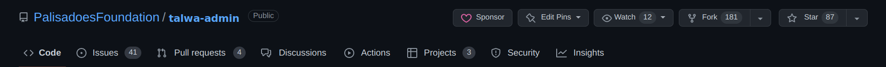
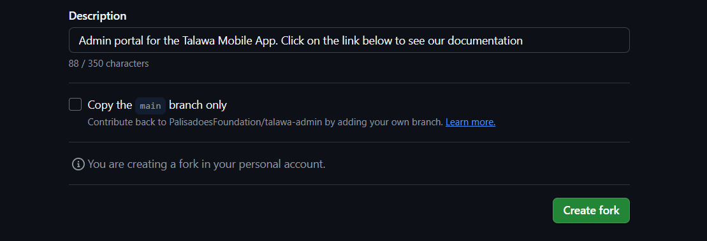

Installation is not difficult, but there are many steps. This is a brief explanation of what needs to be done:

1. Install `git`
2. Download the code from GitHub using `git`
3. Install `node.js` (Node), the runtime environment the application will need to work.
4. Configure the Node Package Manager (`pnpm`) to automatically use the correct version of Node for our application.
5. Use `npm` to install TypeScript, the language the application is written in.
6. Install other supporting software such as the database.
7. Configure the application
8. Start the application

These steps are explained in more detail in the sections that follow.

## Prerequisites

In this section we'll explain how to set up all the prerequisite software packages to get you up and running.

### Install git

The easiest way to get the latest copies of our code is to install the `git` package on your computer.

Follow the setup guide for `git` on official [git docs](https://git-scm.com/downloads). Basic `git` knowledge is required for open source contribution so make sure you're comfortable with it. [Here's](https://youtu.be/apGV9Kg7ics) a good tutorial to get started with `git` and `github`.

### Setting up this repository

First you need a local copy of `talawa-admin`. Run the following command in the directory of choice on your local system.

1. On your computer, navigate to the folder where you want to setup the repository.
2. Open a `cmd` (Windows) or `terminal` (Linux or MacOS) session in this folder.
   1. An easy way to do this is to right-click and choose appropriate option based on your OS.
3. **For Our Open Source Contributor Software Developers:**

   1. Next, we'll fork and clone the `talawa-admin` repository.
   1. In your web browser, navigate to [https://github.com/PalisadoesFoundation/talawa-admin/](https://github.com/PalisadoesFoundation/talawa-admin/) and click on the `fork` button. It is placed on the right corner opposite the repository name `PalisadoesFoundation/talawa-admin`.

      

   1. You should now see `talawa-admin` under your repositories. It will be marked as forked from `PalisadoesFoundation/talawa-admin`

      

   1. Clone the repository to your local computer (replacing the values in `{{}}`):
      ```bash
      $ git clone https://github.com/{{YOUR GITHUB USERNAME}}/talawa-admin.git
      cd talawa-admin
      git checkout develop
      ```
      - **Note:** Make sure to check out the `develop` branch
   1. You now have a local copy of the code files.
   1. For more detailed instructions on contributing code, please review the following documents in the root directory of the code:
      1. CONTRIBUTING.md
      2. CODE_OF_CONDUCT.md
      3. CODE_STYLE.md
      4. DOCUMENTATION.md
      5. INSTALLATION.md
      6. ISSUE_GUIDELINES.md
      7. PR_GUIDELINES.md

4. **Talawa Administrators:**

   1. Clone the repository to your local computer using this command:

      ```bash
      $ git clone https://github.com/PalisadoesFoundation/talawa-admin.git
      ```

### Install node.js

Best way to install and manage `node.js` is making use of node version managers. We recommend using `fnm`, which will be described in more detail later.

Follow these steps to install the `node.js` packages in Windows, Linux and MacOS.

1. For Windows:
   1. first install `node.js` from their website at https://nodejs.org
      1. When installing, don't click the option to install the `necessary tools`. These are not needed in our case.
   2. then install [fnm](https://github.com/Schniz/fnm). Please read all the steps in this section first.
      1. All the commands listed on this page will need to be run in a Windows terminal session in the `talawa-admin` directory.
      2. Install `fnm` using the `winget` option listed on the page.
      3. Setup `fnm` to automatically set the version of `node.js` to the version required for the repository using these steps:
         1. First, refer to the `fnm` web page's section on `Shell Setup` recommendations.
         2. Open a `Windows PowerShell` terminal window
         3. Run the recommended `Windows PowerShell` command to open `notepad`.
         4. Paste the recommended string into `notepad`
         5. Save the document.
         6. Exit `notepad`
         7. Exit PowerShell
         8. This will ensure that you are always using the correct version of `node.js`
2. For Linux and MacOS, use the terminal window.
   1. install `node.js`
   2. then install `fnm`
      1. Refer to the installation page's section on the `Shell Setup` recommendations.
      2. Run the respective recommended commands to setup your node environment
      3. This will ensure that you are always using the correct version of `node.js`

### Install TypeScript

TypeScript is a typed superset of JavaScript that compiles to plain JavaScript. It adds optional types, classes, and modules to JavaScript, and supports tools for large-scale JavaScript applications.

To install TypeScript, you can use the `npm` command which comes with `node.js`:

```bash
npm install -g typescript
```

This command installs TypeScript globally on your system so that it can be accessed from any project.

### Install Required Packages

Run the following command to install the packages and dependencies required by the app:

```
pnpm install
```

The prerequisites are now installed. The next step will be to get the app up and running.

## Installation using Docker

Docker is used to build, deploy, and manage applications within isolated, lightweight containers, effectively packaging an application with all its dependencies so it can run consistently across different environments, allowing for faster development, testing, and deployment of software.

We use it to simplify installation

### Prerequisites

Follow these steps to install Docker on your system

- [Docker Desktop for Windows/Mac](https://www.docker.com/products/docker-desktop)
- [Docker Engine for Linux](https://docs.docker.com/engine/install/)

You now need to setup the environment. This follows next.

#### Development Setup

If you prefer to use Docker, you can install the app using the following command:

1. Create a `.env` file as described in the Configuration section

2. Build and Run the Docker Image:

   Run the following command to run the Docker image:

   ```bash
   docker-compose -f docker/docker-compose.dev.yaml --env-file .env up
   ```

3. To stop the container run the following command:

   ```bash
   docker-compose -f docker/docker-compose.dev.yaml down
   ```

The application will be accessible at `http://localhost:4321`

#### Production Setup

If you prefer to use Docker, you can install the app using the following command:

1. Create a `.env` file as described in the Configuration section

2. Configure `nginx.conf` file located at `config/docker/setup`. Modify it to fit your preferences before running the application.

3. Build and Run the Docker Image:

   Run the following command to run the Docker image:

   ```bash
   docker-compose -f docker/docker-compose.prod.yaml --env-file .env up
   ```

4. To stop the container run the following command:

   ```bash
   docker-compose -f docker/docker-compose.prod.yaml down
   ```

The application will be accessible at `http://localhost:4321`
