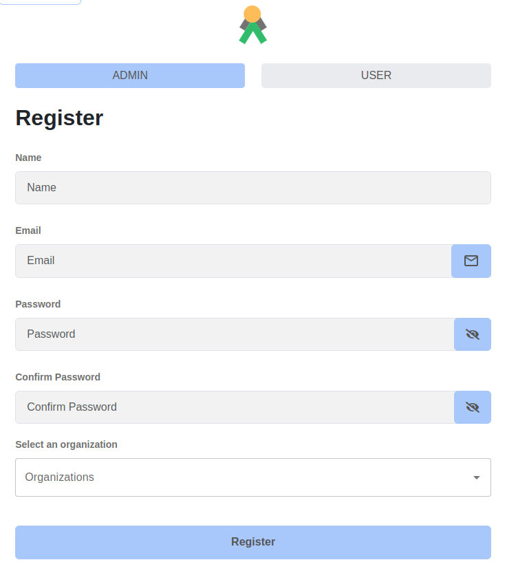

This page outlines how to successfully operate the application

## Accessing Talawa-Admin

The login process is different depending on the type of user.

### Regular Users

By default `talawa-admin` runs on port `4321` on your system's localhost. It is available on the following endpoint:

```

http://localhost:4321/

```

If you have specified a custom port number in your `.env` file, Talawa-Admin will run on the following endpoint:

```

http://localhost:{{customPort}}/

```

Replace `{{customPort}}` with the actual custom port number you have configured in your `.env` file.

### Administrators

To login as an administrator, navigate to the `/admin` URI to enter the credentials.

## User Registration

The first time you navigate to the running talawa-admin's website you'll land at talawa-admin user login page.

1. New users can register by clicking the **Register** button on the login page.
2. Sign up using whatever credentials you want and create the account.
   - Make sure to remember the email and password you entered because they'll be used to sign you in later on.

The registration link will be clearly visible on the login page:



**Note:** Administrator accounts cannot be created through the registration process. Admin credentials must be provisioned separately and managed outside the application interface.

## Login

The login process is different depending on the scenario

### User Login

Now sign in to talawa-admin using the `email` and `password` you used to sign up.

### First Time API Administrator Login

The email address and password are defined these API environment variables:

1. `API_ADMINISTRATOR_USER_EMAIL_ADDRESS`
1. `API_ADMINISTRATOR_USER_NAME`
1. `API_ADMINISTRATOR_USER_PASSWORD`

In a development environment, the defaults are:

1. `API_ADMINISTRATOR_USER_EMAIL_ADDRESS`=administrator@email.com
1. `API_ADMINISTRATOR_USER_NAME`=administrator
1. `API_ADMINISTRATOR_USER_PASSWORD`=password

## Initial Administrator Tasks

After setting up `talawa-admin` and `talawa-api`, the database will have only one user: **Administrator**.

To create new administrators you need to register a new user and then manually grant them **Administrator** privileges.

### Register as an Administrator

Register a new user as described in the section above.

### Granting Administrator Roles to Registered Users

1. Open **GraphiQL** in your browser:

2. Sign in as Administrator

   1. Use the following GraphQL **query** to get an **authentication token** for authorization in later queries:
   2. Replace `user-id` with the actual ID of the registered user and `org-id` with organization ID wherever necessary. You can obtain this form the postgres database via cloudbeaver.

   ```graphql
   mutation {
     signIn(
       input: { emailAddress: "administrator@email.com", password: "password" }
     ) {
       authenticationToken
       user {
         id
         name
       }
     }
   }
   ```

3. Make the registered user an Administrator

   - Use the following GraphQL mutation to assign an administrator role to user:

   ```graphql
   mutation {
     updateUser(input: { id: "user-id", role: administrator }) {
       id
       name
     }
   }
   ```

4. Next create an organization

   - Use the following GraphQL mutation to create an organization:

   ```graphql
   mutation {
     createOrganization(
       input: {
         addressLine1: "Los Angeles"
         addressLine2: "USA"
         city: "Los Angeles"
         countryCode: in
         description: "testing"
         name: "Test Org 7"
         postalCode: "876876"
         state: "California"
       }
     ) {
       id
     }
   }
   ```

5. Make the user an administrator of the organization

   - Use the following GraphQL mutation to assign an administrator to an organization:

   ```graphql
     createOrganizationMembership(
    input: {
      memberId: "user-id"
      organizationId: "org-id"
      role: administrator
    }
   ) {
    id
    name
    addressLine1
    createdAt
    members(first: 5) {
      pageInfo {
        hasNextPage
        startCursor
      }
      edges {
        cursor
        node {
          id
          name
        }
      }
    }
   }
   }
   ```

Now sign successfully in with your registered ADMIN.
